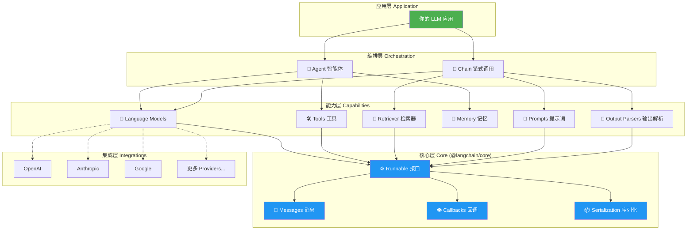
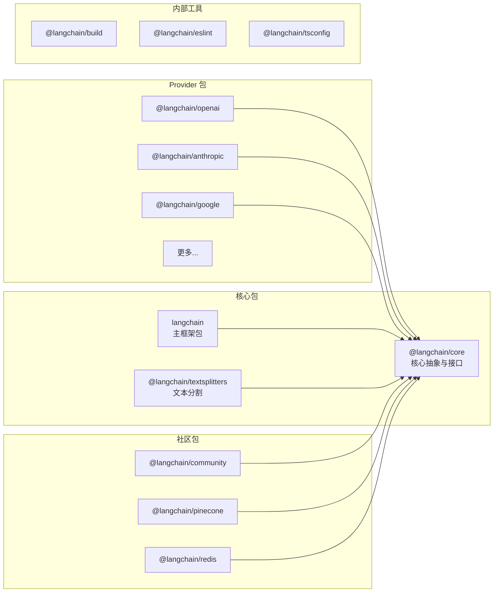
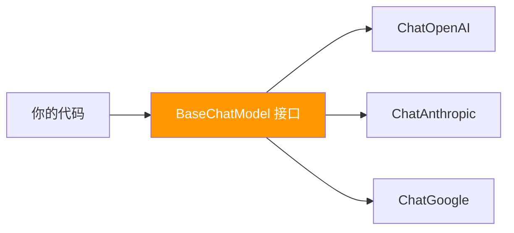

# 🚀 第 1 章：走进 LangChain

> 理解 LangChain 是什么、为什么需要它、以及它的整体架构

## 📌 本章目标

- 了解大语言模型（LLM）的局限性
- 理解 LangChain 解决了什么问题
- 掌握 LangChain.js 的整体架构
- 了解各个包之间的关系

---

## 1.1 🤔 大语言模型的「能」与「不能」

### LLM 能做什么？

大语言模型（Large Language Model，简称 LLM），如 GPT-4、Claude、Gemini，本质上是一个**超强的文本生成器**。你给它一段文字（Prompt），它会生成一段相关的回复。

```
输入: "请用一句话解释什么是 TypeScript"
输出: "TypeScript 是 JavaScript 的超集，添加了静态类型系统和其他特性。"
```

### 🎯 类比：LLM 就像一个博学但「被关在房间里」的专家

想象有一位博学多才的专家，他读过几乎所有的书，知识渊博。但是：

| 能力 | 描述 | 类比 |
|------|------|------|
| ✅ 回答问题 | 基于已有知识生成答案 | 专家可以回答你问的问题 |
| ✅ 写作翻译 | 生成各种格式的文本 | 专家会多国语言 |
| ✅ 代码编写 | 生成和理解代码 | 专家懂编程 |
| ❌ 实时信息 | 不知道训练数据之后的事 | 专家在房间里，看不到外面 |
| ❌ 执行操作 | 不能调 API、查数据库 | 专家只能动嘴，不能动手 |
| ❌ 私有数据 | 不了解你公司内部的数据 | 专家没读过你的私有文档 |
| ❌ 精确计算 | 数学计算可能出错 | 专家不擅长心算 |
| ❌ 持久记忆 | 每次对话都是全新的 | 专家每次见你都不记得上次聊了什么 |

### 💡 LangChain 的角色

**LangChain 就是给这位专家配上工具和助手的框架：**

- 🔧 **工具箱（Tools）**：让专家能查搜索引擎、调接口、用计算器
- 📚 **资料柜（RAG）**：让专家能查阅你的私有文档
- 🧠 **记事本（Memory）**：让专家能记住之前的对话
- 📋 **工作流（Chains）**：让专家按照固定流程办事
- 🤖 **自主决策（Agent）**：让专家根据情况自主判断该做什么

---

## 1.2 🏗️ LangChain.js 整体架构

LangChain.js 采用**分层架构**，从底层到上层可以分为以下几层：



### 🎯 类比：像搭积木一样构建应用

可以把 LangChain 想象成一套**乐高积木**：

- **核心层（Core）** = 积木的接口标准（保证所有积木能拼在一起）
- **能力层（Capabilities）** = 各种功能积木（模型、工具、检索器等）
- **编排层（Orchestration）** = 组合好的结构（Agent、Chain）
- **集成层（Integrations）** = 不同品牌的积木（OpenAI、Anthropic 等）

只要遵循统一的接口标准（Runnable），任何积木都可以替换和组合。

---

## 1.3 📦 仓库包结构

LangChain.js 是一个 **Monorepo（单仓多包）**，用 pnpm workspace 管理。下面是各个包的职责：



### 各包详细说明

| 包名 | 路径 | 职责 | 类比 |
|------|------|------|------|
| `@langchain/core` | `libs/langchain-core/` | 定义所有核心接口和抽象类 | 宪法：定义基本规则 |
| `langchain` | `libs/langchain/` | 主框架包，提供 Agent 等高级功能 | 政府：基于宪法运作 |
| `@langchain/openai` | `libs/providers/langchain-openai/` | OpenAI 模型集成 | 专业服务商 A |
| `@langchain/anthropic` | `libs/providers/langchain-anthropic/` | Anthropic 模型集成 | 专业服务商 B |
| `@langchain/community` | `libs/community/langchain-community/` | 社区贡献的集成 | 开源社区贡献 |
| `@langchain/textsplitters` | `libs/langchain-textsplitters/` | 文本分割工具 | 文档拆分工具 |

### 为什么要这么拆分？

1. **按需安装**：你只用 OpenAI？只装 `@langchain/openai` 就行，不用把 20 多个 Provider 都装上
2. **独立版本**：各个包可以独立发版，互不影响
3. **降低耦合**：核心接口（`@langchain/core`）很稳定，Provider 可以快速迭代
4. **社区友好**：第三方开发者可以基于 `@langchain/core` 开发自己的集成

---

## 1.4 🔑 六大核心概念预览

在深入学习之前，先来认识 LangChain 中最重要的六个概念：

### 1️⃣ Runnable（可运行体）

> 📦 源码位置：`libs/langchain-core/src/runnables/base.ts`

**万物皆 Runnable** —— LangChain 中几乎所有组件都实现了 `Runnable` 接口，这意味着它们都有统一的使用方式：

```typescript
// 所有组件都支持这三种调用方式
await component.invoke(input);    // 单次调用
await component.batch(inputs);    // 批量调用
await component.stream(input);    // 流式调用
```

### 2️⃣ Messages（消息）

> 📦 源码位置：`libs/langchain-core/src/messages/`

消息是 LLM 交互的**基本通信单元**，就像聊天软件里的一条条消息：

```typescript
import { HumanMessage, AIMessage, SystemMessage } from "@langchain/core/messages";

const messages = [
  new SystemMessage("你是一个友好的助手"),    // 系统设定
  new HumanMessage("你好！"),                 // 用户消息
  new AIMessage("你好！有什么可以帮你的？"),    // AI 回复
];
```

### 3️⃣ Prompt Template（提示词模板）

> 📦 源码位置：`libs/langchain-core/src/prompts/`

把提示词变成**可复用的模板**，就像 HTML 模板引擎：

```typescript
import { ChatPromptTemplate } from "@langchain/core/prompts";

const prompt = ChatPromptTemplate.fromMessages([
  ["system", "你是一个{role}专家"],
  ["human", "{question}"],
]);

// 填入变量，生成实际的消息
const messages = await prompt.invoke({
  role: "TypeScript",
  question: "什么是泛型？",
});
```

### 4️⃣ Tools（工具）

> 📦 源码位置：`libs/langchain-core/src/tools/`

让 LLM 能够**调用外部函数**，比如搜索网页、查询数据库：

```typescript
import { tool } from "@langchain/core/tools";
import { z } from "zod";

const weatherTool = tool(
  async ({ city }) => {
    // 调用天气 API
    return `${city}今天晴，25°C`;
  },
  {
    name: "get_weather",
    description: "查询指定城市的天气",
    schema: z.object({ city: z.string().describe("城市名称") }),
  }
);
```

### 5️⃣ Chain（链）

将多个组件**串联**起来，形成处理管道：

```typescript
// prompt → model → parser 形成一条链
const chain = prompt.pipe(model).pipe(outputParser);
const result = await chain.invoke({ question: "什么是 LangChain？" });
```

### 6️⃣ Agent（智能体）

> 📦 源码位置：`libs/langchain/src/agents/`

能够**自主决策**使用哪些工具来完成任务的智能系统：

```typescript
import { createAgent } from "langchain/agents";

const agent = createAgent({
  model: "openai:gpt-4o",
  tools: [searchTool, calculatorTool, weatherTool],
  prompt: "你是一个全能助手，请帮用户解决问题。",
});

// Agent 会自己决定使用哪些工具
const result = await agent.invoke({
  messages: [{ role: "user", content: "北京今天天气怎么样？" }],
});
```

---

## 1.5 📐 设计哲学

LangChain.js 的设计遵循以下核心原则：

### 🔌 面向接口编程

所有组件都基于抽象接口（`Runnable`），而不是具体实现。这就是为什么你可以轻松地把 OpenAI 模型换成 Anthropic 模型，而不用改任何业务代码。



### 🧩 组合优于继承

LangChain 鼓励用 `.pipe()` 把小组件组合成大功能，而不是通过继承创建复杂的类层次结构。

### 🌊 流式优先

从底层开始就支持流式处理（Streaming），让用户能看到 LLM 逐字生成回答的过程，提升用户体验。

### 📏 最小化依赖

核心包（`@langchain/core`）几乎没有外部依赖，各 Provider 包按需安装，避免「全家桶」问题。

---

## 1.6 📝 本章小结

| 概念 | 一句话解释 |
|------|-----------|
| **LangChain** | 一个让 LLM 能连接外部世界、记住历史、使用工具的框架 |
| **Runnable** | 所有组件的统一接口，支持 invoke/batch/stream |
| **Messages** | LLM 对话的基本消息格式 |
| **Prompt** | 可复用的提示词模板 |
| **Tools** | 让 LLM 调用外部函数的机制 |
| **Chain** | 组件的串联组合 |
| **Agent** | 能自主决策的智能系统 |
| **Monorepo** | 单仓多包的项目组织方式 |

---

> 📖 下一章：[🧱 第 2 章：核心概念 - Runnable 接口](./02-core-concepts.md) —— 深入理解 LangChain 的万物基石
