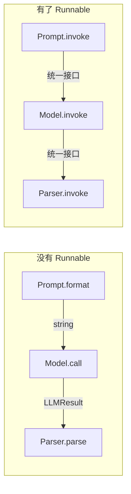
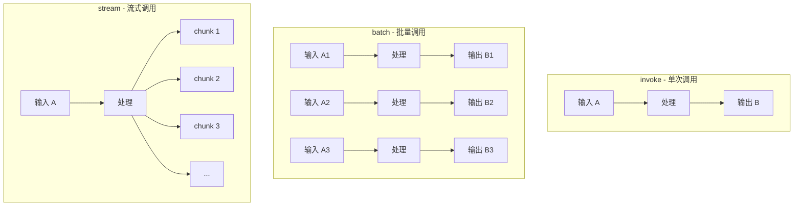
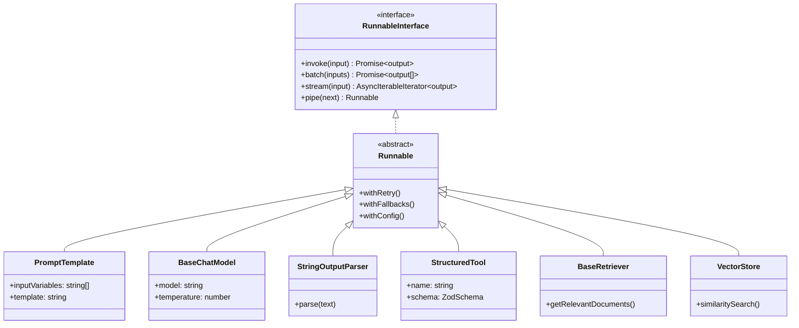
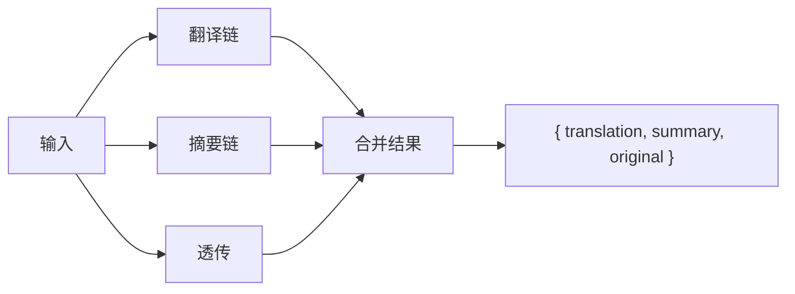

# 🧱 第 2 章：核心概念 - Runnable 接口

> 深入理解 LangChain 的「万物基石」—— Runnable 设计模式

## 📌 本章目标

- 理解 Runnable 接口的设计动机
- 掌握 invoke、batch、stream 三大核心方法
- 学会用 pipe 组合 Runnable
- 了解 RunnableConfig 配置系统

---

## 2.1 🤔 为什么需要 Runnable？

### 问题场景

假设你在构建一个 LLM 应用，需要处理这样的流程：

```
用户输入 → 生成提示词 → 调用模型 → 解析输出 → 返回结果
```

如果每个组件的 API 都不一样，你的代码会变成这样：

```typescript
// ❌ 没有统一接口的混乱世界
const promptResult = prompt.format(input);          // format? generate? create?
const modelResult = await model.call(promptResult); // call? predict? run?
const parsed = parser.parse(modelResult.text);      // parse? extract? process?
```

每个组件有不同的方法名、不同的参数格式、不同的返回类型，组合起来非常痛苦。

### 🎯 类比：USB 接口的启发

回忆一下 USB 接口出现之前的世界：每种设备都有自己的专用接口 —— 打印机用并口、鼠标用 PS/2、手机充电各不相同。USB 的出现统一了这一切。

**Runnable 就是 LangChain 世界的「USB 接口」**：



---

## 2.2 🔍 Runnable 接口详解

> 📦 源码位置：`libs/langchain-core/src/runnables/base.ts`

### 核心接口定义

```typescript
// 简化后的 Runnable 接口
interface RunnableInterface<RunInput, RunOutput, CallOptions> {
  // 🎯 单次调用：输入 → 输出
  invoke(input: RunInput, options?: Partial<CallOptions>): Promise<RunOutput>;

  // 📦 批量调用：多个输入 → 多个输出
  batch(
    inputs: RunInput[],
    options?: Partial<CallOptions>
  ): Promise<RunOutput[]>;

  // 🌊 流式调用：输入 → 输出流（逐步产出）
  stream(
    input: RunInput,
    options?: Partial<CallOptions>
  ): Promise<IterableReadableStream<RunOutput>>;

  // 🔗 组合：将当前 Runnable 与下一个连接
  pipe<NewRunOutput>(
    next: RunnableLike<RunOutput, NewRunOutput>
  ): Runnable<RunInput, NewRunOutput>;
}
```

### 三大核心方法



#### 1️⃣ `invoke` —— 最基础的调用方式

```typescript
import { ChatPromptTemplate } from "@langchain/core/prompts";

const prompt = ChatPromptTemplate.fromMessages([
  ["system", "你是一个翻译助手"],
  ["human", "请将以下内容翻译成{language}：{text}"],
]);

// invoke: 传入参数，等待完整结果
const result = await prompt.invoke({
  language: "英文",
  text: "你好世界",
});
// result 是完整的消息列表
```

#### 2️⃣ `batch` —— 高效的批量处理

```typescript
// batch: 一次处理多个输入
const results = await prompt.batch([
  { language: "英文", text: "你好" },
  { language: "日文", text: "谢谢" },
  { language: "韩文", text: "再见" },
]);
// results 是三个结果的数组
```

💡 **为什么用 batch 而不是循环调用 invoke？**

- **性能优化**：可以控制并发数（`maxConcurrency`），避免 API 限流
- **统一错误处理**：一次性处理所有结果的成功/失败
- **批量折扣**：某些 API 支持批量调用优惠

#### 3️⃣ `stream` —— 流式输出

```typescript
// stream: 逐步获取结果
const stream = await model.stream("给我讲个笑话");

for await (const chunk of stream) {
  process.stdout.write(chunk.content as string);
  // 逐字打印，就像 ChatGPT 的打字效果
}
```

🎯 **类比**：

- `invoke` 就像发快递 —— 等所有东西打包好了一起送到
- `stream` 就像流水线传送带 —— 做好一个就送一个过来

---

## 2.3 🔗 pipe —— Runnable 的组合魔法

> 📦 源码位置：`libs/langchain-core/src/runnables/base.ts` 中的 `pipe` 方法

`pipe` 是 Runnable 最强大的能力 —— **将多个组件串联成一条流水线**。

### 基本用法

```typescript
import { ChatPromptTemplate } from "@langchain/core/prompts";
import { StringOutputParser } from "@langchain/core/output_parsers";

// 假设 model 是一个 ChatModel 实例
const chain = prompt
  .pipe(model)        // prompt 的输出 → model 的输入
  .pipe(new StringOutputParser()); // model 的输出 → parser 的输入

// 现在 chain 也是一个 Runnable！
const result = await chain.invoke({
  language: "英文",
  text: "你好世界",
});
// result: "Hello World"
```

### 🎯 类比：工厂流水线


就像工厂的流水线一样：
- 每个工位（Runnable）只负责自己的任务
- 上一个工位的产出就是下一个工位的输入
- 整条流水线本身也是一个「超级工位」（也是 Runnable）

### pipe 的类型安全

TypeScript 的泛型保证了 pipe 的类型安全：

```typescript
// prompt: Runnable<{language: string, text: string}, ChatPromptValue>
// model:  Runnable<ChatPromptValue, AIMessage>
// parser: Runnable<AIMessage, string>

const chain = prompt.pipe(model).pipe(parser);
// chain: Runnable<{language: string, text: string}, string>
// ✅ 输入类型和最终输出类型都是类型安全的
```

---

## 2.4 🛡️ Runnable 的超能力

### withRetry —— 自动重试

```typescript
// 网络波动？API 偶尔超时？加上重试策略
const reliableModel = model.withRetry({
  stopAfterAttempt: 3,      // 最多重试 3 次
  onFailedAttempt: (error) => {
    console.log(`重试中... 错误: ${error.message}`);
  },
});
```

### withFallbacks —— 备选方案

```typescript
// 主模型挂了？自动切换到备用模型
const resilientModel = primaryModel.withFallbacks({
  fallbacks: [backupModel1, backupModel2],
});
// 先试 primaryModel，失败了试 backupModel1，再失败试 backupModel2
```

### withConfig —— 绑定配置

```typescript
// 预设一些配置参数
const configuredModel = model.withConfig({
  tags: ["production"],
  metadata: { userId: "user_123" },
  maxConcurrency: 5,
});
```

### 🎯 类比：快递服务的增值选项

| 方法 | 类比 |
|------|------|
| `withRetry` | 快递丢了自动补发 |
| `withFallbacks` | 首选顺丰，不行就用中通 |
| `withConfig` | 设置默认收货地址 |

---

## 2.5 ⚙️ RunnableConfig 配置系统

> 📦 源码位置：`libs/langchain-core/src/runnables/config.ts`

每次调用 Runnable 时，都可以传入一个配置对象来控制行为：

```typescript
interface RunnableConfig {
  // 📋 回调处理器（用于日志、追踪等）
  callbacks?: Callbacks;
  
  // 🏷️ 标签（用于分类和筛选）
  tags?: string[];
  
  // 📊 元数据（附加信息）
  metadata?: Record<string, unknown>;
  
  // 🔢 最大并发数（batch 时生效）
  maxConcurrency?: number;
  
  // ⏱️ 超时时间
  timeout?: number;
  
  // 🛑 中止信号
  signal?: AbortSignal;
  
  // 🔑 运行名称（用于追踪）
  runName?: string;
}
```

### 使用示例

```typescript
// 带配置的调用
const result = await chain.invoke(
  { question: "什么是 TypeScript？" },
  {
    // 超时 30 秒
    timeout: 30000,
    // 添加标签便于追踪
    tags: ["user-query", "typescript"],
    // 添加元数据
    metadata: { userId: "user_123", source: "web" },
    // 支持取消
    signal: abortController.signal,
  }
);
```

---

## 2.6 🧩 常见 Runnable 类型一览

LangChain.js 中所有的核心组件都是 Runnable 的具体实现：



| Runnable 类型 | 输入 | 输出 | 典型用途 |
|--------------|------|------|----------|
| `PromptTemplate` | 变量对象 | 格式化的提示词 | 生成提示词 |
| `BaseChatModel` | 消息列表 | AI 消息 | 调用 LLM |
| `StringOutputParser` | AI 消息 | 纯文本字符串 | 提取文本 |
| `JsonOutputParser` | AI 消息 | JSON 对象 | 提取结构化数据 |
| `StructuredTool` | 工具参数 | 工具执行结果 | 执行外部操作 |
| `BaseRetriever` | 查询字符串 | 文档列表 | 检索相关文档 |
| `RunnableLambda` | 任意 | 任意 | 自定义函数包装 |
| `RunnablePassthrough` | 任意 | 原样传递 | 数据透传 |
| `RunnableParallel` | 任意 | 合并结果 | 并行执行 |

---

## 2.7 🔀 RunnableParallel —— 并行执行

有时你需要同时执行多个操作，然后合并结果：

```typescript
import { RunnableParallel } from "@langchain/core/runnables";

// 并行执行：同时获取翻译和摘要
const parallelChain = RunnableParallel.from({
  translation: translationChain,  // 翻译链
  summary: summaryChain,          // 摘要链
  original: new RunnablePassthrough(), // 原文保留
});

const result = await parallelChain.invoke("LangChain is awesome");
// result: {
//   translation: "LangChain 太棒了",
//   summary: "关于 LangChain 的正面评价",
//   original: "LangChain is awesome"
// }
```



---

## 2.8 📝 本章小结

| 概念 | 要点 |
|------|------|
| **Runnable 接口** | LangChain 的统一组件接口，所有组件都实现它 |
| **invoke** | 单次调用，最基础的方式 |
| **batch** | 批量调用，支持并发控制 |
| **stream** | 流式调用，逐步产出结果 |
| **pipe** | 将多个 Runnable 串联成链 |
| **withRetry** | 自动重试机制 |
| **withFallbacks** | 备选方案机制 |
| **RunnableConfig** | 控制调用行为的配置 |
| **RunnableParallel** | 并行执行多个 Runnable |

### 💡 核心收获

1. **万物皆 Runnable**：LangChain 中的每个组件都是 Runnable
2. **统一接口**：invoke/batch/stream 是与任何组件交互的标准方式
3. **组合优先**：用 pipe 将小组件组合成复杂的处理管道
4. **类型安全**：TypeScript 泛型确保组件之间的输入/输出类型正确匹配

---

> 📖 下一章：[💬 第 3 章：消息与提示词模板](./03-messages-and-prompts.md) —— 学习如何与 LLM 进行结构化对话
