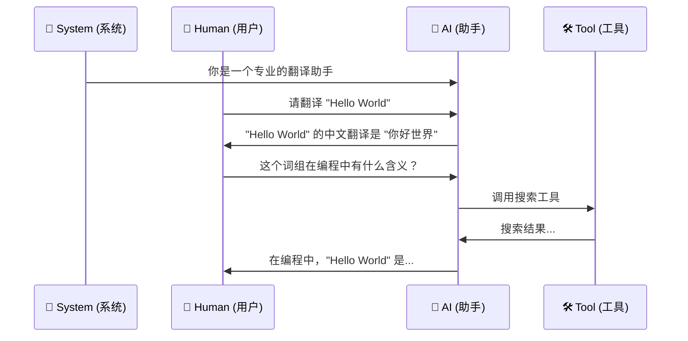
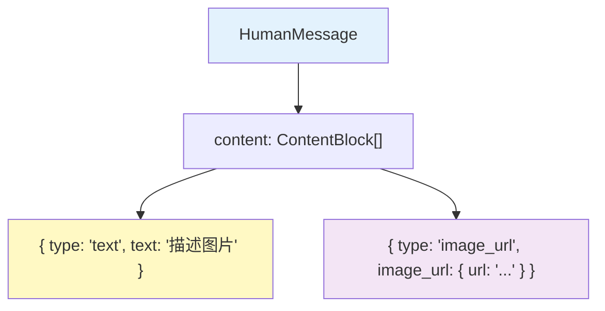
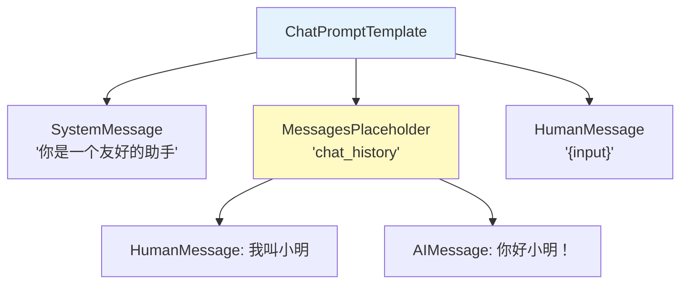
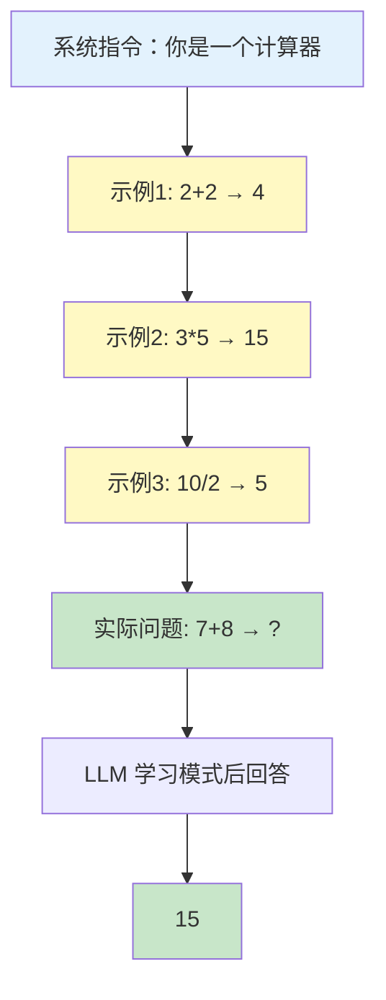
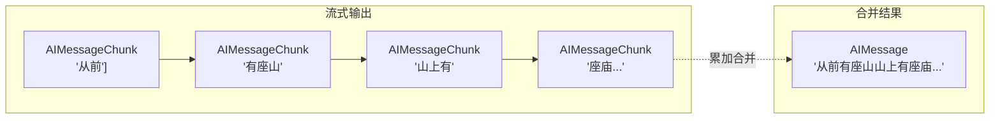

# 💬 第 3 章：消息与提示词模板

> 学习如何与 LLM 进行结构化对话

## 📌 本章目标

- 掌握 LangChain 的消息类型体系
- 学会使用提示词模板（PromptTemplate）
- 理解 Few-shot 学习的实现方式
- 了解多模态消息的支持

---

## 3.1 🗨️ 消息类型体系

> 📦 源码位置：`libs/langchain-core/src/messages/`

### 为什么需要消息类型？

与 LLM 对话不只是「发一段文字」那么简单。现代的 Chat Model 需要区分不同角色的消息。就像在微信群里，你需要知道每条消息是谁发的：



### 五种核心消息类型

```typescript
import {
  SystemMessage,    // 系统消息：设定 AI 的角色和行为
  HumanMessage,     // 人类消息：用户的输入
  AIMessage,        // AI 消息：模型的回复
  ToolMessage,      // 工具消息：工具的执行结果
  ChatMessage,      // 通用消息：自定义角色
} from "@langchain/core/messages";
```

#### 1️⃣ SystemMessage —— 系统指令

```typescript
// 设定 AI 的角色、规则和行为边界
const systemMsg = new SystemMessage(
  "你是一个专业的代码审查员。请用中文回答，对代码提出建设性意见。"
);
```

🎯 **类比**：就像给新员工的「入职须知」—— 告诉 AI 它是谁、该怎么表现。

#### 2️⃣ HumanMessage —— 用户输入

```typescript
// 用户说的话
const humanMsg = new HumanMessage("请帮我审查这段 TypeScript 代码");
```

#### 3️⃣ AIMessage —— 模型回复

```typescript
// AI 的回复，可能包含工具调用
const aiMsg = new AIMessage({
  content: "我来看看这段代码...",
  tool_calls: [
    {
      id: "call_001",
      name: "code_analyzer",
      args: { code: "...", language: "typescript" },
    },
  ],
});
```

⚠️ **注意**：`AIMessage` 有一个特殊字段 `tool_calls`，用于 LLM 发起工具调用。这是实现 Agent 的关键机制（详见第 7、8 章）。

#### 4️⃣ ToolMessage —— 工具返回结果

```typescript
// 工具执行后返回的结果
const toolMsg = new ToolMessage({
  content: "代码分析结果：发现 3 个潜在问题...",
  tool_call_id: "call_001",  // 对应 AIMessage 中的 tool_calls.id
});
```

#### 5️⃣ ChatMessage —— 自定义角色

```typescript
// 自定义角色消息（较少使用）
const customMsg = new ChatMessage({
  content: "这是一条自定义角色的消息",
  role: "moderator",
});
```

### 消息的内部结构

每条消息都继承自 `BaseMessage`，具有以下字段：

```typescript
interface BaseMessage {
  content: string | ContentBlock[];  // 消息内容（支持多模态）
  name?: string;                     // 发送者名称
  id?: string;                       // 消息唯一 ID
  additional_kwargs: Record<string, unknown>;  // 额外参数
  response_metadata: Record<string, unknown>;  // 响应元数据
}
```

---

## 3.2 🖼️ 多模态消息

> 📦 源码位置：`libs/langchain-core/src/messages/base.ts` 中的 `ContentBlock` 类型

现代 LLM（如 GPT-4o、Claude 3）支持图片输入。LangChain 通过 `ContentBlock` 数组来表示多模态内容：

```typescript
const multiModalMsg = new HumanMessage({
  content: [
    { type: "text", text: "请描述这张图片" },
    {
      type: "image_url",
      image_url: {
        url: "https://example.com/cat.jpg",
        // 或使用 base64
        // url: "data:image/jpeg;base64,/9j/4AAQ...",
      },
    },
  ],
});
```



---

## 3.3 📝 提示词模板系统

> 📦 源码位置：`libs/langchain-core/src/prompts/`

### 为什么需要提示词模板？

直接拼接字符串来构造 Prompt 容易出错且难以维护：

```typescript
// ❌ 直接拼接：难维护、容易出错
const prompt = `你是一个${role}专家。请回答：${question}`;

// ✅ 使用模板：可复用、类型安全、支持组合
const template = PromptTemplate.fromTemplate(
  "你是一个{role}专家。请回答：{question}"
);
```

### PromptTemplate —— 基础字符串模板

```typescript
import { PromptTemplate } from "@langchain/core/prompts";

// 创建模板
const template = PromptTemplate.fromTemplate(
  "请将以下{language}代码转换为 Python：\n\n{code}"
);

// 模板也是 Runnable，支持 invoke
const result = await template.invoke({
  language: "TypeScript",
  code: "const greet = (name: string) => `Hello, ${name}!`;",
});

// result 是格式化后的字符串：
// "请将以下TypeScript代码转换为 Python：
//
// const greet = (name: string) => `Hello, ${name}!`;"
```

### ChatPromptTemplate —— 聊天消息模板 ⭐

这是最常用的模板类型，用于构造完整的对话消息序列：

```typescript
import { ChatPromptTemplate, MessagesPlaceholder } from "@langchain/core/prompts";

// 方式 1：使用元组 [角色, 内容]
const prompt = ChatPromptTemplate.fromMessages([
  ["system", "你是一个{specialty}领域的专家助手"],
  ["human", "{question}"],
]);

// 调用模板
const messages = await prompt.invoke({
  specialty: "机器学习",
  question: "什么是梯度下降？",
});
// 结果是 [SystemMessage, HumanMessage] 消息数组
```

### MessagesPlaceholder —— 动态消息占位

当你需要在模板中插入**不确定数量**的消息时（比如聊天历史），使用 `MessagesPlaceholder`：

```typescript
const promptWithHistory = ChatPromptTemplate.fromMessages([
  ["system", "你是一个友好的助手"],
  new MessagesPlaceholder("chat_history"),  // 动态插入历史消息
  ["human", "{input}"],
]);

// 调用时传入历史消息
const messages = await promptWithHistory.invoke({
  chat_history: [
    new HumanMessage("我叫小明"),
    new AIMessage("你好小明！很高兴认识你！"),
  ],
  input: "你还记得我的名字吗？",
});

// 结果是：
// [
//   SystemMessage("你是一个友好的助手"),
//   HumanMessage("我叫小明"),
//   AIMessage("你好小明！很高兴认识你！"),
//   HumanMessage("你还记得我的名字吗？"),
// ]
```



---

## 3.4 🎓 Few-shot 提示词

> 📦 源码位置：`libs/langchain-core/src/prompts/few_shot.ts`

### 什么是 Few-shot 学习？

**Few-shot** 是一种通过给 LLM 提供几个示例来「教」它如何执行任务的技巧。

🎯 **类比**：就像教小孩认字 —— 你不用解释「苹果」这两个字的笔画规则，只要指着苹果说几遍「苹果」，小孩就学会了。

### 使用示例

```typescript
import { FewShotChatMessagePromptTemplate, ChatPromptTemplate } from "@langchain/core/prompts";

// 定义单个示例的格式
const examplePrompt = ChatPromptTemplate.fromMessages([
  ["human", "{input}"],
  ["ai", "{output}"],
]);

// 创建 Few-shot 模板
const fewShotPrompt = new FewShotChatMessagePromptTemplate({
  examplePrompt,
  examples: [
    { input: "2+2", output: "4" },
    { input: "3*5", output: "15" },
    { input: "10/2", output: "5" },
  ],
  inputVariables: ["input"],
});

// 组合成完整的提示词
const fullPrompt = ChatPromptTemplate.fromMessages([
  ["system", "你是一个计算器。请只输出计算结果，不要解释。"],
  fewShotPrompt,
  ["human", "{input}"],
]);

// 使用
const messages = await fullPrompt.invoke({ input: "7+8" });
// LLM 会学习示例的模式，直接输出 "15"
```

### Few-shot 的工作原理



### 💡 为什么 Few-shot 有效？

LLM 通过训练已经学会了「模式识别」。当你给出几个输入→输出的示例时，LLM 会：
1. 识别出示例中的模式（数学计算 → 直接输出数字）
2. 将这个模式应用到新的输入上
3. 生成符合该模式的输出

这比写一大段「请只输出数字，不要解释过程...」的指令要有效得多。

---

## 3.5 🔧 Partial 模板 —— 部分填充

有时你在创建模板时只知道部分变量，其余变量需要运行时才能确定：

```typescript
const template = ChatPromptTemplate.fromMessages([
  ["system", "你是一个{language}编程助手。今天是{date}。"],
  ["human", "{question}"],
]);

// 先填充已知的变量
const partialTemplate = await template.partial({
  date: new Date().toLocaleDateString(),
});

// 运行时再填充剩余变量
const messages = await partialTemplate.invoke({
  language: "TypeScript",
  question: "如何定义一个接口？",
});
```

🎯 **类比**：就像填表格 —— 有些信息（日期、地点）可以提前填好，其他信息（姓名、事由）等到用的时候再填。

---

## 3.6 📐 模板与 Runnable 的结合

提示词模板作为 Runnable，可以无缝接入 pipe 链：

```typescript
import { ChatPromptTemplate } from "@langchain/core/prompts";
import { StringOutputParser } from "@langchain/core/output_parsers";

// prompt → model → parser 组成完整的链
const chain = ChatPromptTemplate.fromMessages([
  ["system", "你是一个简洁的翻译助手，只输出翻译结果"],
  ["human", "请将以下中文翻译成{targetLang}：{text}"],
])
  .pipe(model)
  .pipe(new StringOutputParser());

// 一行调用，完成 模板填充 → LLM 调用 → 输出解析
const translation = await chain.invoke({
  targetLang: "日文",
  text: "你好世界",
});
// translation: "こんにちは世界"
```

---

## 3.7 🧩 消息的流式处理

消息在流式场景下有对应的 **Chunk** 变体：

```typescript
import { AIMessageChunk } from "@langchain/core/messages";

// 流式输出时，每个 chunk 都是 AIMessageChunk
const stream = await model.stream([new HumanMessage("讲个故事")]);

let fullContent = "";
for await (const chunk of stream) {
  // chunk 是 AIMessageChunk
  fullContent += chunk.content;
  process.stdout.write(chunk.content as string);
}
```

**Chunk 与 Message 的关系**：



---

## 3.8 📝 本章小结

| 概念 | 要点 |
|------|------|
| **消息类型** | System / Human / AI / Tool / Chat 五种角色 |
| **多模态** | 通过 ContentBlock 支持文本 + 图片 |
| **PromptTemplate** | 字符串提示词模板 |
| **ChatPromptTemplate** | 聊天消息模板（最常用） |
| **MessagesPlaceholder** | 动态消息占位符（用于聊天历史等） |
| **Few-shot** | 通过示例教 LLM 完成任务 |
| **Partial** | 部分填充模板变量 |
| **Chunk** | 消息的流式分块版本 |

### 💡 核心收获

1. **消息是 LLM 交互的基本单元**，不同类型对应不同角色
2. **提示词模板让 Prompt 可复用、可组合**，避免字符串拼接
3. **Few-shot 是最简单有效的引导 LLM 行为的方式**
4. **模板也是 Runnable**，可以无缝接入处理链

---

> 📖 下一章：[🤖 第 4 章：语言模型](./04-language-models.md) —— 了解 Chat Model 和 LLM 的底层架构
