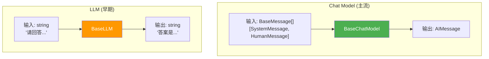
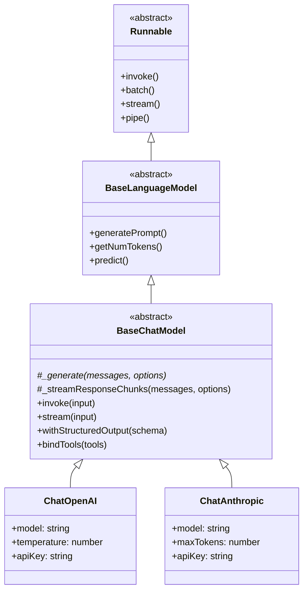
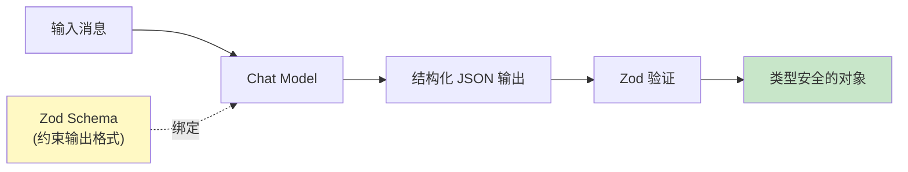
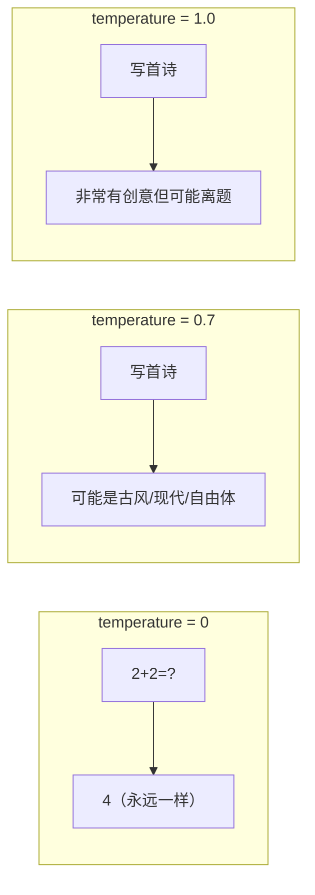

# 🤖 第 4 章：语言模型

> 了解 Chat Model 和 LLM 的底层架构、Provider 体系和结构化输出

## 📌 本章目标

- 理解 Chat Model 与 LLM 的区别
- 掌握 BaseChatModel 的核心方法
- 了解 Provider 包的架构设计
- 学会使用结构化输出
- 理解 `initChatModel` 的统一模型加载

---

## 4.1 📖 Chat Model vs LLM

> 📦 源码位置：
> - Chat Model: `libs/langchain-core/src/language_models/chat_models.ts`
> - LLM: `libs/langchain-core/src/language_models/llms.ts`

LangChain 中有两种语言模型抽象：

| 类型 | 基类 | 输入 | 输出 | 典型模型 |
|------|------|------|------|----------|
| **Chat Model** | `BaseChatModel` | 消息列表 `BaseMessage[]` | `AIMessage` | GPT-4o, Claude 3, Gemini |
| **LLM** | `BaseLLM` | 纯文本 `string` | 纯文本 `string` | GPT-3 (text-davinci), 旧版模型 |



💡 **现在几乎所有主流模型都是 Chat Model**。LLM（纯文本模型）主要是为了兼容旧版模型。本教程后续主要讨论 Chat Model。

---

## 4.2 🧬 BaseChatModel 核心架构

> 📦 源码位置：`libs/langchain-core/src/language_models/chat_models.ts`

### 继承层次



### 核心方法说明

```typescript
abstract class BaseChatModel extends BaseLanguageModel {
  /**
   * 🔑 核心抽象方法：每个 Provider 必须实现
   * 接收消息列表，返回 ChatResult
   */
  abstract _generate(
    messages: BaseMessage[],
    options: this["ParsedCallOptions"],
    runManager?: CallbackManagerForLLMRun
  ): Promise<ChatResult>;

  /**
   * 🌊 流式响应（可选实现）
   * 逐块返回生成的内容
   */
  async *_streamResponseChunks(
    messages: BaseMessage[],
    options: this["ParsedCallOptions"],
    runManager?: CallbackManagerForLLMRun
  ): AsyncGenerator<ChatGenerationChunk> {
    // 默认实现：调用 _generate 然后一次性返回
    // Provider 可以覆盖此方法提供真正的流式响应
  }

  /**
   * 🛠️ 绑定工具
   * 让模型知道可以调用哪些工具
   */
  bindTools(tools: ToolDefinition[]): Runnable {
    // 将工具定义绑定到模型参数中
  }

  /**
   * 📐 结构化输出
   * 让模型按指定的 schema 输出结构化数据
   */
  withStructuredOutput<T>(schema: z.ZodType<T>): Runnable<BaseMessage[], T> {
    // 约束模型输出符合 schema
  }
}
```

### 🎯 类比：BaseChatModel 就像「外卖平台的商家接口」

- **平台（LangChain）** 定义了统一的接口：接单（invoke）、批量接单（batch）、实时配送（stream）
- **商家（Provider）** 只需实现核心的「做菜」方法（`_generate`）
- **顾客（你的应用）** 不用关心哪家店做的，统一的下单流程

---

## 4.3 🏭 Provider 架构设计

> 📦 源码位置：`libs/providers/` 目录

### Provider 包结构

每个 Provider 包遵循相同的结构：

```
libs/providers/langchain-openai/
├── src/
│   ├── index.ts              # 包的主入口
│   ├── chat_models/          # Chat Model 实现
│   │   ├── index.ts          # ChatOpenAI 类
│   │   └── tests/
│   │       ├── index.test.ts          # 单元测试
│   │       └── index.int.test.ts      # 集成测试
│   ├── llms/                 # LLM 实现（如有）
│   ├── embeddings.ts         # 嵌入模型
│   └── tools/                # 提供商特定工具
├── package.json
└── tsconfig.json
```

### 一个 Provider 是如何实现的

以简化的 `ChatOpenAI` 为例：

```typescript
import { BaseChatModel } from "@langchain/core/language_models/chat_models";
import type { BaseMessage } from "@langchain/core/messages";

class ChatOpenAI extends BaseChatModel {
  model: string = "gpt-4o";
  temperature: number = 0.7;
  apiKey: string;

  constructor(params: ChatOpenAIParams) {
    super(params);
    this.model = params.model ?? this.model;
    this.apiKey = params.apiKey ?? getEnvironmentVariable("OPENAI_API_KEY");
  }

  // 🔑 核心实现：调用 OpenAI API
  async _generate(
    messages: BaseMessage[],
    options: this["ParsedCallOptions"]
  ): Promise<ChatResult> {
    // 1. 将 LangChain 消息转为 OpenAI 格式
    const openAIMessages = convertToOpenAIMessages(messages);

    // 2. 调用 OpenAI API
    const response = await fetch("https://api.openai.com/v1/chat/completions", {
      method: "POST",
      headers: { Authorization: `Bearer ${this.apiKey}` },
      body: JSON.stringify({
        model: this.model,
        messages: openAIMessages,
        temperature: this.temperature,
      }),
    });

    // 3. 将 OpenAI 响应转回 LangChain 格式
    const data = await response.json();
    return {
      generations: [
        {
          message: new AIMessage(data.choices[0].message.content),
          text: data.choices[0].message.content,
        },
      ],
    };
  }

  // 🌊 流式实现
  async *_streamResponseChunks(
    messages: BaseMessage[],
    options: this["ParsedCallOptions"]
  ): AsyncGenerator<ChatGenerationChunk> {
    // 使用 SSE（Server-Sent Events）逐块接收响应
    // 每收到一块就 yield 出去
  }
}
```

### 支持的 Provider 列表

| Provider | 包名 | 支持的模型 |
|----------|------|-----------|
| OpenAI | `@langchain/openai` | GPT-4o, GPT-4, GPT-3.5 |
| Anthropic | `@langchain/anthropic` | Claude 3.5, Claude 3 |
| Google | `@langchain/google-genai` | Gemini Pro, Gemini Ultra |
| AWS Bedrock | `@langchain/aws` | Claude, Llama 等（通过 AWS） |
| Mistral | `@langchain/mistralai` | Mistral Large, Medium |
| Groq | `@langchain/groq` | Llama, Mixtral（超快推理） |
| Ollama | `@langchain/ollama` | 本地模型（Llama, Phi 等） |
| DeepSeek | `@langchain/deepseek` | DeepSeek-V3 等 |
| xAI | `@langchain/xai` | Grok |
| 更多... | `libs/providers/` | 20+ Provider |

---

## 4.4 📐 结构化输出

> 📦 源码位置：`libs/langchain-core/src/language_models/chat_models.ts` 中的 `withStructuredOutput`

### 问题：LLM 的输出是自由文本

```typescript
// LLM 可能返回各种格式的回答
"这部电影的评分是 8.5 分，类型是科幻片，导演是诺兰。"
"评分：8.5\n类型：科幻\n导演：诺兰"
"{"score": 8.5, "genre": "sci-fi"}"  // 也可能返回 JSON
```

如果你的代码需要精确提取这些信息，解析自由文本非常痛苦。

### 解决方案：withStructuredOutput

```typescript
import { z } from "zod";

// 定义输出结构
const movieSchema = z.object({
  title: z.string().describe("电影名称"),
  score: z.number().describe("评分，1-10"),
  genre: z.string().describe("电影类型"),
  director: z.string().describe("导演"),
});

// 让模型按 schema 输出
const structuredModel = model.withStructuredOutput(movieSchema);

const result = await structuredModel.invoke(
  "请分析电影《星际穿越》"
);

// result 是类型安全的对象 ✅
console.log(result.title);    // "星际穿越"
console.log(result.score);    // 9.2
console.log(result.genre);    // "科幻"
console.log(result.director); // "克里斯托弗·诺兰"
```

### 工作原理



底层实现机制取决于 Provider：
- **OpenAI**：使用 `response_format: { type: "json_schema" }` 或 function calling
- **Anthropic**：使用 tool_use 机制
- **其他**：使用 prompt 引导 + 输出解析

---

## 4.5 🔗 bindTools —— 绑定工具

让模型知道可以调用哪些工具（详细内容见第 7 章）：

```typescript
import { tool } from "@langchain/core/tools";

const searchTool = tool(
  async ({ query }) => `搜索结果：${query}`,
  {
    name: "search",
    description: "搜索互联网",
    schema: z.object({ query: z.string() }),
  }
);

// 将工具绑定到模型
const modelWithTools = model.bindTools([searchTool]);

// 模型现在可能在回复中包含 tool_calls
const result = await modelWithTools.invoke([
  new HumanMessage("帮我搜索 LangChain 的最新版本"),
]);

if (result.tool_calls && result.tool_calls.length > 0) {
  console.log("模型想调用工具:", result.tool_calls);
  // [{ name: "search", args: { query: "LangChain latest version" } }]
}
```

---

## 4.6 🎛️ initChatModel —— 统一模型加载

> 📦 源码位置：`libs/langchain/src/chat_models/universal.ts`

不想记住每个 Provider 的类名和导入路径？`initChatModel` 提供了统一的加载方式：

```typescript
import { initChatModel } from "langchain/chat_models/universal";

// 使用 "provider:model" 格式
const openaiModel = await initChatModel("openai:gpt-4o");
const claudeModel = await initChatModel("anthropic:claude-3-5-sonnet");
const geminiModel = await initChatModel("google-genai:gemini-pro");

// 等效于：
// import { ChatOpenAI } from "@langchain/openai";
// const openaiModel = new ChatOpenAI({ model: "gpt-4o" });
```

### 为什么使用 initChatModel？

1. **统一入口**：一个函数搞定所有 Provider
2. **运行时切换**：可以通过配置文件或环境变量动态选择模型
3. **简化代码**：不用手动 import 各个 Provider 包

```typescript
// 通过配置动态选择模型
const modelName = process.env.LLM_MODEL || "openai:gpt-4o";
const model = await initChatModel(modelName, {
  temperature: 0.7,
  maxTokens: 1000,
});
```

---

## 4.7 🌊 流式输出详解

### 基本流式使用

```typescript
const stream = await model.stream([
  new SystemMessage("你是一个故事家"),
  new HumanMessage("请写一个关于程序员的小故事"),
]);

for await (const chunk of stream) {
  // chunk 是 AIMessageChunk
  process.stdout.write(chunk.content as string);
}
```

### 事件流（StreamEvents）

更细粒度的流式事件，可以追踪整个链的执行过程：

```typescript
const chain = prompt.pipe(model).pipe(parser);

const eventStream = chain.streamEvents(
  { question: "什么是 TypeScript？" },
  { version: "v2" }
);

for await (const event of eventStream) {
  switch (event.event) {
    case "on_llm_start":
      console.log("🚀 模型开始生成...");
      break;
    case "on_llm_stream":
      process.stdout.write(event.data.chunk.content);
      break;
    case "on_llm_end":
      console.log("\n✅ 模型生成完毕");
      break;
  }
}
```

---

## 4.8 ⚙️ 模型参数配置

### 常用参数

```typescript
const model = new ChatOpenAI({
  model: "gpt-4o",           // 模型名称
  temperature: 0.7,           // 创造性（0=确定性，1=高创造性）
  maxTokens: 2000,            // 最大输出 token 数
  topP: 0.9,                  // 核采样参数
  frequencyPenalty: 0,        // 频率惩罚
  presencePenalty: 0,         // 存在惩罚
  timeout: 30000,             // 超时（毫秒）
  maxRetries: 2,              // API 调用最大重试次数
});
```

### 🎯 温度参数类比



| 温度 | 适用场景 | 类比 |
|------|----------|------|
| 0 | 代码生成、数据提取 | 严谨的会计 |
| 0.3-0.5 | 问答、摘要 | 认真的助理 |
| 0.7-0.9 | 创意写作、头脑风暴 | 灵活的创意总监 |
| 1.0 | 极度发散的创作 | 疯狂的艺术家 |

---

## 4.9 📝 本章小结

| 概念 | 要点 |
|------|------|
| **Chat Model** | 以消息为单位交互，当前主流方式 |
| **BaseChatModel** | 所有 Chat Model 的抽象基类 |
| **_generate** | Provider 必须实现的核心方法 |
| **Provider 包** | 每个 LLM 提供商一个独立包 |
| **withStructuredOutput** | 让 LLM 输出结构化数据 |
| **bindTools** | 告诉模型可以调用哪些工具 |
| **initChatModel** | 统一的模型加载入口 |
| **temperature** | 控制输出创造性/确定性的关键参数 |

### 💡 核心收获

1. **BaseChatModel 是适配器模式的典范** —— 统一接口，不同实现
2. **Provider 只需实现 `_generate` 方法** —— 框架处理其他一切
3. **结构化输出让 LLM 融入业务系统** —— 不再需要痛苦地解析自由文本
4. **流式支持是内置的** —— 从基类开始就设计了流式能力

---

> 📖 下一章：[🔧 第 5 章：输出解析器](./05-output-parsers.md) —— 将 LLM 的自由文本转为结构化数据
