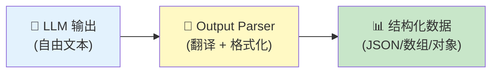
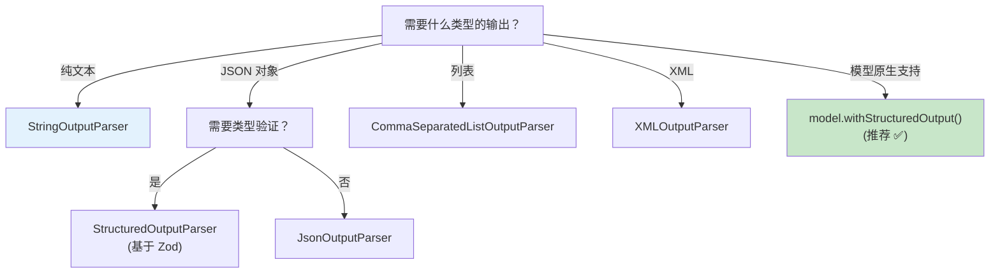
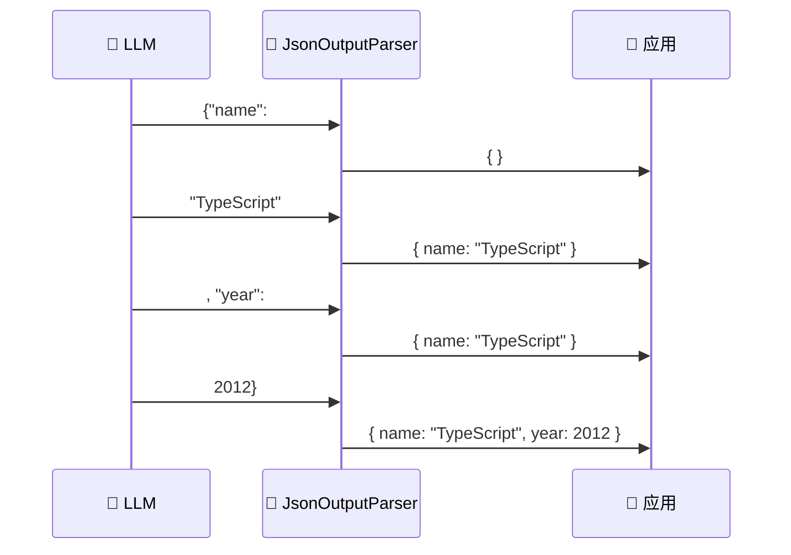

# 🔧 第 5 章：输出解析器

> 将 LLM 的自由文本输出转为可靠的结构化数据

## 📌 本章目标

- 理解为什么需要输出解析器
- 掌握常用解析器的使用方法
- 了解解析器与流式输出的配合
- 学会在链中正确使用解析器

---

## 5.1 🤔 为什么需要输出解析器？

> 📦 源码位置：`libs/langchain-core/src/output_parsers/`

### 问题

LLM 本质上是一个「文本生成器」，它的输出永远是字符串。但我们的应用需要的往往是**结构化数据**：

```typescript
// LLM 的原始输出（AIMessage）
const aiMessage = await model.invoke([
  new HumanMessage("列出 3 种常见的编程语言及其用途"),
]);
// aiMessage.content 可能是：
// "1. Python - 数据科学、机器学习\n2. JavaScript - Web 开发\n3. Go - 后端服务、云原生"
```

这只是一段文本！你的代码如何从中提取出一个数组呢？

### 🎯 类比：翻译官

如果 LLM 是外国专家，输出解析器就是翻译官 —— 不仅翻译语言，还帮你把专家的口述整理成格式化的文档。



---

## 5.2 📋 常用输出解析器

### 1️⃣ StringOutputParser —— 最简单的解析器

> 📦 源码位置：`libs/langchain-core/src/output_parsers/string.ts`

从 AIMessage 中提取纯文本内容，也是最常用的解析器：

```typescript
import { StringOutputParser } from "@langchain/core/output_parsers";

const parser = new StringOutputParser();

// 直接使用
const text = await parser.invoke(aiMessage);
// "1. Python - 数据科学..."（纯字符串，不再是 AIMessage 对象）

// 在链中使用（最常见的方式）
const chain = prompt.pipe(model).pipe(new StringOutputParser());
const result = await chain.invoke({ question: "你好" });
// result 直接就是字符串
```

💡 **什么时候用 StringOutputParser？**
- 当你只需要 LLM 的文本输出，不关心消息的元数据时
- 作为链的最后一步，将 AIMessage 简化为 string

### 2️⃣ JsonOutputParser —— JSON 解析器

> 📦 源码位置：`libs/langchain-core/src/output_parsers/json.ts`

让 LLM 输出 JSON，并自动解析为 JavaScript 对象：

```typescript
import { JsonOutputParser } from "@langchain/core/output_parsers";

// 定义期望的类型（可选）
interface MovieInfo {
  title: string;
  year: number;
  genre: string[];
}

const parser = new JsonOutputParser<MovieInfo>();

const chain = ChatPromptTemplate.fromMessages([
  ["system", "你是一个电影数据库。请以 JSON 格式回答，包含 title、year、genre 字段。"],
  ["human", "{query}"],
])
  .pipe(model)
  .pipe(parser);

const result = await chain.invoke({ query: "介绍电影《盗梦空间》" });
// result: { title: "盗梦空间", year: 2010, genre: ["科幻", "动作", "悬疑"] }
```

### 3️⃣ StructuredOutputParser —— 基于 Zod 的结构化解析

```typescript
import { StructuredOutputParser } from "@langchain/core/output_parsers";
import { z } from "zod";

const parser = StructuredOutputParser.fromZodSchema(
  z.object({
    name: z.string().describe("编程语言名称"),
    paradigm: z.string().describe("编程范式"),
    yearCreated: z.number().describe("创建年份"),
    pros: z.array(z.string()).describe("优点列表"),
    cons: z.array(z.string()).describe("缺点列表"),
  })
);

// parser 可以生成格式化指令
const formatInstructions = parser.getFormatInstructions();
// 这会告诉 LLM 需要输出什么格式的 JSON

const chain = ChatPromptTemplate.fromMessages([
  ["system", "请按以下格式输出：\n{format_instructions}"],
  ["human", "分析 {language} 编程语言"],
])
  .pipe(model)
  .pipe(parser);

const result = await chain.invoke({
  language: "TypeScript",
  format_instructions: formatInstructions,
});
// result: {
//   name: "TypeScript",
//   paradigm: "多范式",
//   yearCreated: 2012,
//   pros: ["类型安全", "IDE 支持好", ...],
//   cons: ["编译步骤", "学习曲线", ...]
// }
```

### 4️⃣ CommaSeparatedListOutputParser —— 列表解析

```typescript
import { CommaSeparatedListOutputParser } from "@langchain/core/output_parsers";

const parser = new CommaSeparatedListOutputParser();

const chain = ChatPromptTemplate.fromTemplate(
  "列出 5 种{category}，用逗号分隔"
)
  .pipe(model)
  .pipe(parser);

const result = await chain.invoke({ category: "水果" });
// result: ["苹果", "香蕉", "橙子", "葡萄", "西瓜"]
```

### 5️⃣ XMLOutputParser —— XML 格式解析

```typescript
import { XMLOutputParser } from "@langchain/core/output_parsers";

const parser = new XMLOutputParser();

const chain = ChatPromptTemplate.fromTemplate(
  "请用 XML 格式描述{topic}的三个特点，使用 <features><feature> 标签"
)
  .pipe(model)
  .pipe(parser);

const result = await chain.invoke({ topic: "TypeScript" });
// result: { features: { feature: ["类型安全", "可维护性", "生态丰富"] } }
```

---

## 5.3 🔄 解析器的对比与选择



| 解析器 | 输出类型 | 可靠性 | 适用场景 |
|--------|----------|--------|----------|
| `StringOutputParser` | `string` | ⭐⭐⭐⭐⭐ | 需要纯文本时 |
| `JsonOutputParser` | `object` | ⭐⭐⭐ | 简单 JSON 提取 |
| `StructuredOutputParser` | `typed object` | ⭐⭐⭐⭐ | 需要 Zod 类型验证 |
| `CommaSeparatedListOutputParser` | `string[]` | ⭐⭐⭐ | 简单列表 |
| `model.withStructuredOutput()` | `typed object` | ⭐⭐⭐⭐⭐ | **推荐方式** |

⚠️ **重要提示**：如果你的模型支持 `withStructuredOutput()`（第 4 章），优先使用它而不是 Output Parser。因为 `withStructuredOutput` 利用模型的原生能力（如 function calling），比 prompt 引导更可靠。

---

## 5.4 🌊 解析器与流式输出

解析器在流式场景中有特殊处理。某些解析器支持**流式解析**，即边接收 LLM 输出边解析：

```typescript
// JsonOutputParser 支持流式累加解析
const parser = new JsonOutputParser();
const chain = prompt.pipe(model).pipe(parser);

const stream = await chain.stream({ query: "分析 TypeScript" });

for await (const chunk of stream) {
  console.log("当前解析结果:", chunk);
  // 第 1 次: {}
  // 第 2 次: { name: "Type" }
  // 第 3 次: { name: "TypeScript" }
  // 第 4 次: { name: "TypeScript", year: 2012 }
  // ...逐步补全
}
```



---

## 5.5 🧩 自定义输出解析器

可以使用 `RunnableLambda` 快速创建自定义解析逻辑：

```typescript
import { RunnableLambda } from "@langchain/core/runnables";

// 方式 1：简单函数包装
const customParser = new RunnableLambda({
  func: (aiMessage: AIMessage) => {
    const content = aiMessage.content as string;
    // 自定义解析逻辑
    const lines = content.split("\n").filter(Boolean);
    return lines.map((line, i) => ({
      index: i + 1,
      content: line.replace(/^\d+\.\s*/, ""),
    }));
  },
});

const chain = prompt.pipe(model).pipe(customParser);
```

---

## 5.6 ⚠️ 常见陷阱与最佳实践

### 陷阱 1：LLM 输出不是合法 JSON

```typescript
// LLM 可能输出带有 markdown 标记的 JSON
// ```json
// {"name": "test"}
// ```

// JsonOutputParser 会尝试处理这种情况
// 但如果 JSON 格式严重错误，解析会失败
```

**解决方案**：
- 使用 `withStructuredOutput` 替代 prompt 引导
- 在 system prompt 中明确要求格式
- 使用 `withRetry` 重试失败的解析

### 陷阱 2：忘记在 prompt 中给出格式指令

```typescript
// ❌ 没有格式指令，LLM 不知道要输出 JSON
const chain = prompt.pipe(model).pipe(new JsonOutputParser());

// ✅ 在 prompt 中明确要求 JSON 格式
const chain = ChatPromptTemplate.fromMessages([
  ["system", "请以 JSON 格式回答，包含 name 和 age 字段"],
  ["human", "{question}"],
]).pipe(model).pipe(new JsonOutputParser());
```

### 最佳实践总结

1. **优先使用 `withStructuredOutput`** —— 最可靠
2. **在 prompt 中给出明确的格式指令** —— 帮助 LLM 理解期望
3. **用 Zod schema 做类型验证** —— 确保输出符合预期
4. **考虑流式场景** —— 选择支持流式解析的解析器

---

## 5.7 📝 本章小结

| 概念 | 要点 |
|------|------|
| **OutputParser** | 将 LLM 文本输出转为结构化数据的组件 |
| **StringOutputParser** | 最简单，提取纯文本 |
| **JsonOutputParser** | 提取 JSON 对象 |
| **StructuredOutputParser** | 基于 Zod 的类型安全解析 |
| **withStructuredOutput** | 推荐方式，利用模型原生能力 |
| **流式解析** | 支持边接收边解析 |

### 💡 核心收获

1. **输出解析器是 LLM 输出和业务系统之间的桥梁**
2. **解析器也是 Runnable**，可以无缝接入 pipe 链
3. **优先使用 `withStructuredOutput`**，它比 prompt 引导更可靠
4. **选择合适的解析器**取决于你需要的输出类型和可靠性要求

---

> 📖 下一章：[🔗 第 6 章：链式调用](./06-chains.md) —— 用 pipe 组合组件，构建处理管道
