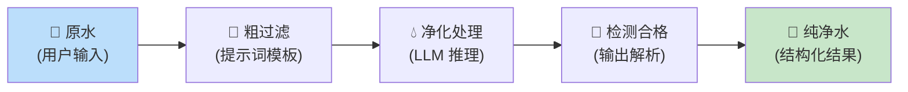
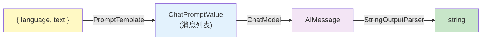
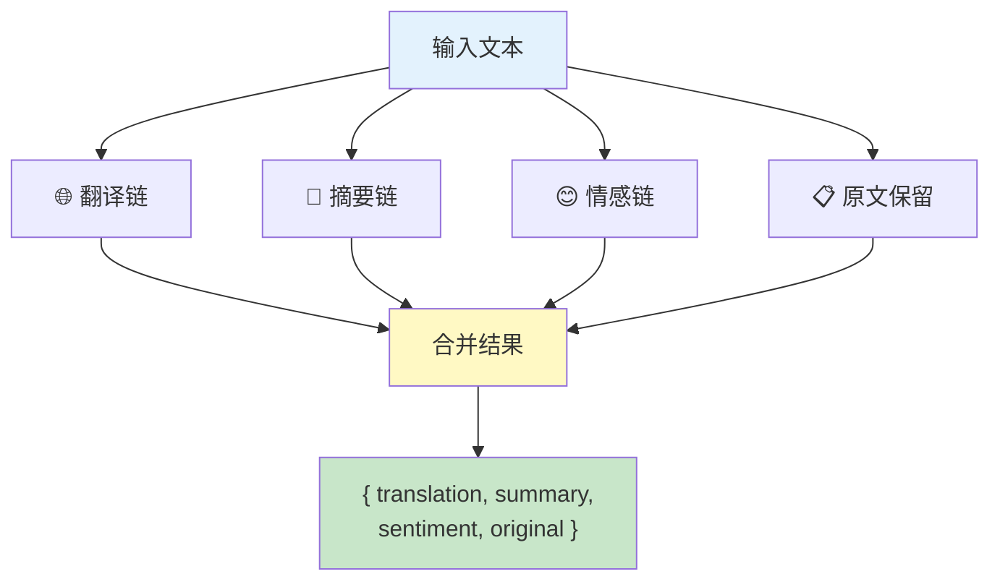
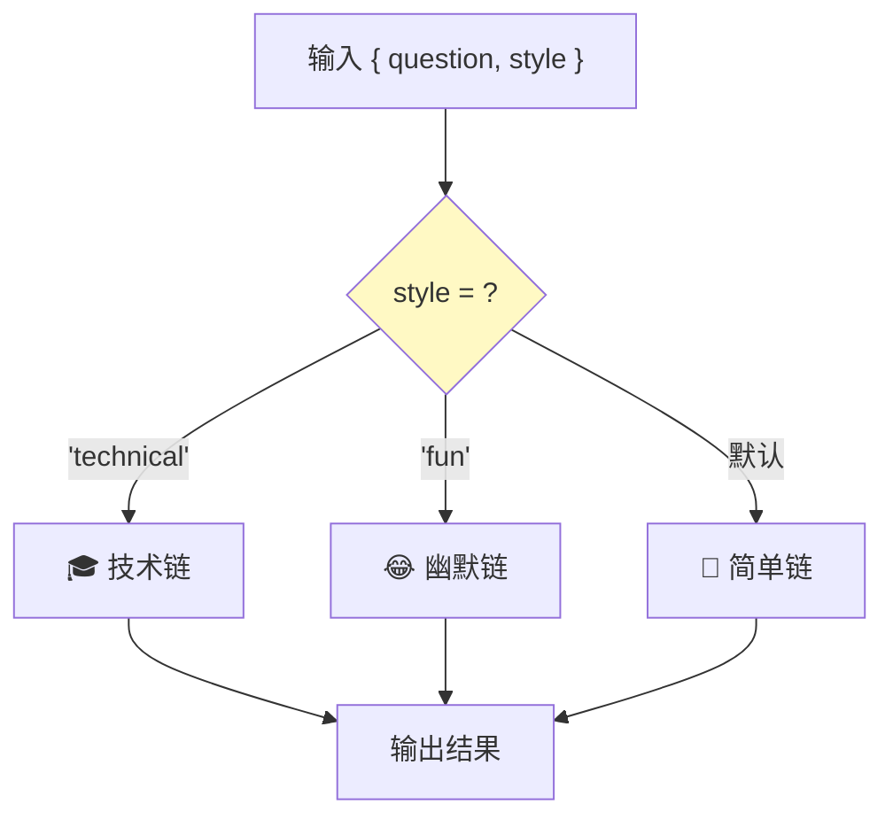
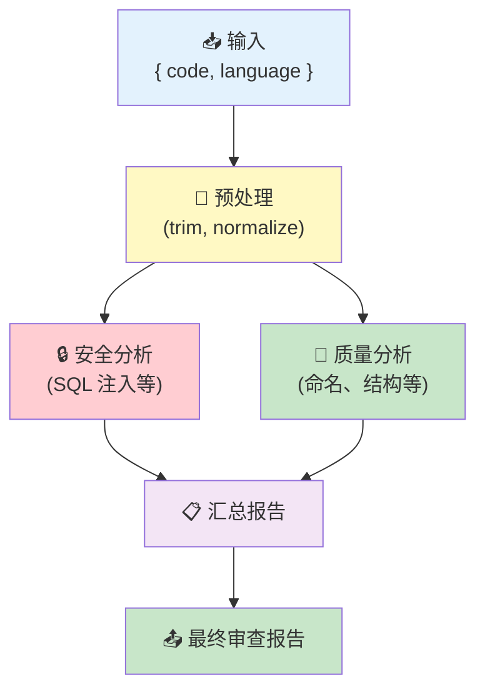

# 🔗 第 6 章：链式调用

> 用 pipe 组合组件，构建处理管道

## 📌 本章目标

- 理解 Chain（链）的概念和演进
- 掌握用 pipe 构建各种处理管道
- 学会使用 RunnableParallel、RunnableBranch 等组合器
- 实践常见的链式调用模式

---

## 6.1 🤔 什么是 Chain？

### 从简单到复杂

单独使用一个 LLM 只能做最基本的文本生成。但实际应用往往需要多个步骤协作：

```
用户提问 → 格式化提示词 → 调用 LLM → 解析输出 → 返回结果
```

在 LangChain 中，把多个组件按顺序连接起来，就形成了一条 **Chain（链）**。

### 🎯 类比：自来水处理厂



每一环节只负责一件事，但串联起来就完成了复杂的处理流程。

---

## 6.2 🔧 pipe —— 构建链的核心方式

### 最基础的链

```typescript
import { ChatPromptTemplate } from "@langchain/core/prompts";
import { StringOutputParser } from "@langchain/core/output_parsers";

// prompt → model → parser
const chain = ChatPromptTemplate.fromMessages([
  ["system", "你是一个专业的{language}翻译"],
  ["human", "翻译：{text}"],
])
  .pipe(model)                     // 提示词 → LLM
  .pipe(new StringOutputParser()); // LLM 输出 → 纯文本

// 这条链的输入类型：{ language: string, text: string }
// 这条链的输出类型：string
const result = await chain.invoke({
  language: "英文",
  text: "春眠不觉晓",
});
// result: "Spring sleep, unaware of dawn"
```

### 类型流转

在 pipe 链中，每一步的输出就是下一步的输入：



---

## 6.3 🔀 RunnableParallel —— 并行执行

> 📦 源码位置：`libs/langchain-core/src/runnables/base.ts` 中的 `RunnableParallel`

有时需要对同一个输入做多种不同的处理，然后合并结果：

```typescript
import { RunnableParallel, RunnablePassthrough } from "@langchain/core/runnables";

// 定义各个并行分支
const translationChain = ChatPromptTemplate.fromMessages([
  ["system", "翻译成英文，只输出翻译结果"],
  ["human", "{text}"],
]).pipe(model).pipe(new StringOutputParser());

const summaryChain = ChatPromptTemplate.fromMessages([
  ["system", "用一句话总结以下内容"],
  ["human", "{text}"],
]).pipe(model).pipe(new StringOutputParser());

const sentimentChain = ChatPromptTemplate.fromMessages([
  ["system", "分析以下文本的情感倾向，回答：正面/负面/中性"],
  ["human", "{text}"],
]).pipe(model).pipe(new StringOutputParser());

// 🔀 并行执行三条链
const analysisChain = RunnableParallel.from({
  translation: translationChain,
  summary: summaryChain,
  sentiment: sentimentChain,
  original: new RunnablePassthrough(),  // 保留原始输入
});

const result = await analysisChain.invoke({
  text: "LangChain 让构建 LLM 应用变得简单而优雅",
});
// result: {
//   translation: "LangChain makes building LLM applications simple and elegant",
//   summary: "LangChain 是一个简化 LLM 应用开发的框架",
//   sentiment: "正面",
//   original: { text: "LangChain 让构建 LLM 应用变得简单而优雅" }
// }
```



### 🎯 类比：体检流程

体检时你不会先做完验血再做 B 超再做心电图 —— 而是同时去不同科室做检查，最后合并报告。`RunnableParallel` 就是这个道理。

---

## 6.4 🔀 RunnableBranch —— 条件路由

> 📦 源码位置：`libs/langchain-core/src/runnables/branch.ts`

根据输入的内容选择不同的处理路径：

```typescript
import { RunnableBranch } from "@langchain/core/runnables";

const technicalChain = ChatPromptTemplate.fromMessages([
  ["system", "你是技术专家，用专业术语详细回答"],
  ["human", "{question}"],
]).pipe(model).pipe(new StringOutputParser());

const simpleChain = ChatPromptTemplate.fromMessages([
  ["system", "你是科普作家，用最简单的语言回答"],
  ["human", "{question}"],
]).pipe(model).pipe(new StringOutputParser());

const funChain = ChatPromptTemplate.fromMessages([
  ["system", "你是段子手，用幽默的方式回答"],
  ["human", "{question}"],
]).pipe(model).pipe(new StringOutputParser());

// 根据 style 参数选择不同的链
const routerChain = RunnableBranch.from([
  // [条件函数, 对应的链]
  [
    (input: { question: string; style: string }) => input.style === "technical",
    technicalChain,
  ],
  [
    (input: { question: string; style: string }) => input.style === "fun",
    funChain,
  ],
  // 默认分支（最后一个参数）
  simpleChain,
]);

// 使用
const result = await routerChain.invoke({
  question: "什么是 TypeScript？",
  style: "fun",
});
// 会走幽默风格的链
```



---

## 6.5 🔧 RunnableLambda —— 自定义处理步骤

> 📦 源码位置：`libs/langchain-core/src/runnables/base.ts` 中的 `RunnableLambda`

当你需要在链中插入自定义逻辑时，使用 `RunnableLambda` 将普通函数包装成 Runnable：

```typescript
import { RunnableLambda } from "@langchain/core/runnables";

// 将普通函数包装成 Runnable
const formatInput = new RunnableLambda({
  func: (input: { query: string }) => ({
    question: input.query.trim().toLowerCase(),
    timestamp: new Date().toISOString(),
  }),
});

const addMetadata = new RunnableLambda({
  func: (result: string) => ({
    answer: result,
    model: "gpt-4o",
    generatedAt: new Date().toISOString(),
  }),
});

// 在链中使用自定义步骤
const chain = formatInput
  .pipe(prompt)
  .pipe(model)
  .pipe(new StringOutputParser())
  .pipe(addMetadata);

const result = await chain.invoke({ query: "  什么是 TypeScript?  " });
// result: {
//   answer: "TypeScript 是...",
//   model: "gpt-4o",
//   generatedAt: "2024-01-01T00:00:00.000Z"
// }
```

---

## 6.6 📋 RunnablePassthrough —— 数据透传

> 📦 源码位置：`libs/langchain-core/src/runnables/passthrough.ts`

原样传递输入，常用于在 `RunnableParallel` 中保留原始数据：

```typescript
import { RunnablePassthrough, RunnableParallel } from "@langchain/core/runnables";

// 经典的 RAG 场景：并行获取上下文和保留问题
const ragChain = RunnableParallel.from({
  context: retriever,                  // 检索相关文档
  question: new RunnablePassthrough(), // 保留原始问题
})
  .pipe(prompt)   // 将 context 和 question 填入模板
  .pipe(model)
  .pipe(new StringOutputParser());

const answer = await ragChain.invoke("什么是 LangChain？");
```

### assign —— 在透传的同时添加新字段

```typescript
// RunnablePassthrough.assign 会保留原始输入，并添加新计算的字段
const enrichedChain = RunnablePassthrough.assign({
  context: async (input: { question: string }) => {
    // 根据问题检索相关文档
    const docs = await retriever.invoke(input.question);
    return docs.map(d => d.pageContent).join("\n");
  },
});

const result = await enrichedChain.invoke({ question: "什么是 TypeScript？" });
// result: {
//   question: "什么是 TypeScript？",    // 原始字段保留
//   context: "TypeScript 是..."         // 新增的字段
// }
```

---

## 6.7 📊 实战：构建一个完整的处理链

让我们综合运用所学知识，构建一个「代码审查助手」：

```typescript
import { ChatPromptTemplate } from "@langchain/core/prompts";
import { StringOutputParser } from "@langchain/core/output_parsers";
import { RunnableParallel, RunnableLambda } from "@langchain/core/runnables";

// 步骤 1: 预处理输入
const preprocessor = new RunnableLambda({
  func: (input: { code: string; language: string }) => ({
    code: input.code.trim(),
    language: input.language.toLowerCase(),
    lineCount: input.code.split("\n").length,
  }),
});

// 步骤 2: 并行分析
const securityChain = ChatPromptTemplate.fromMessages([
  ["system", "你是安全专家，分析代码中的安全漏洞。"],
  ["human", "语言：{language}\n代码：\n```\n{code}\n```"],
]).pipe(model).pipe(new StringOutputParser());

const qualityChain = ChatPromptTemplate.fromMessages([
  ["system", "你是代码质量专家，分析代码质量问题。"],
  ["human", "语言：{language}\n代码：\n```\n{code}\n```"],
]).pipe(model).pipe(new StringOutputParser());

const parallelAnalysis = RunnableParallel.from({
  security: securityChain,
  quality: qualityChain,
});

// 步骤 3: 汇总报告
const summaryChain = ChatPromptTemplate.fromMessages([
  ["system", "你是技术主管，基于安全和质量分析生成最终审查报告。"],
  ["human", "安全分析：\n{security}\n\n质量分析：\n{quality}"],
]).pipe(model).pipe(new StringOutputParser());

// 组装完整链
const codeReviewChain = preprocessor
  .pipe(parallelAnalysis)
  .pipe(summaryChain);

// 使用
const report = await codeReviewChain.invoke({
  code: `
    function login(username, password) {
      const query = "SELECT * FROM users WHERE name='" + username + "'";
      return db.execute(query);
    }
  `,
  language: "JavaScript",
});
```

### 完整链的执行流程



---

## 6.8 🌊 链的流式处理

整条链也支持流式输出：

```typescript
// 流式执行链
const stream = await chain.stream({
  language: "英文",
  text: "春眠不觉晓",
});

for await (const chunk of stream) {
  process.stdout.write(chunk); // 逐字输出翻译结果
}
```

⚠️ **注意**：流式输出只在链的最后一步生效。中间步骤（如 PromptTemplate）会立即完成，流式体验主要来自 LLM 生成的部分。

---

## 6.9 📝 本章小结

| 概念 | 要点 |
|------|------|
| **Chain** | 将多个 Runnable 串联成处理管道 |
| **pipe** | 构建链的核心方法 |
| **RunnableParallel** | 并行执行多个分支，合并结果 |
| **RunnableBranch** | 条件路由，选择不同的处理路径 |
| **RunnableLambda** | 将自定义函数包装成 Runnable |
| **RunnablePassthrough** | 原样透传数据 |
| **assign** | 透传原始数据并添加新字段 |

### 💡 核心收获

1. **链是 LangChain 的精髓** —— 将简单组件组合成强大的处理流程
2. **pipe 保证类型安全** —— TypeScript 会检查每一步的输入输出是否匹配
3. **并行和分支让链更灵活** —— 不局限于线性的串行执行
4. **整条链也是 Runnable** —— 链可以嵌套，大链包含小链

---

> 📖 下一章：[🛠️ 第 7 章：工具系统](./07-tools.md) —— 让 LLM 能「做事」的工具调用机制
