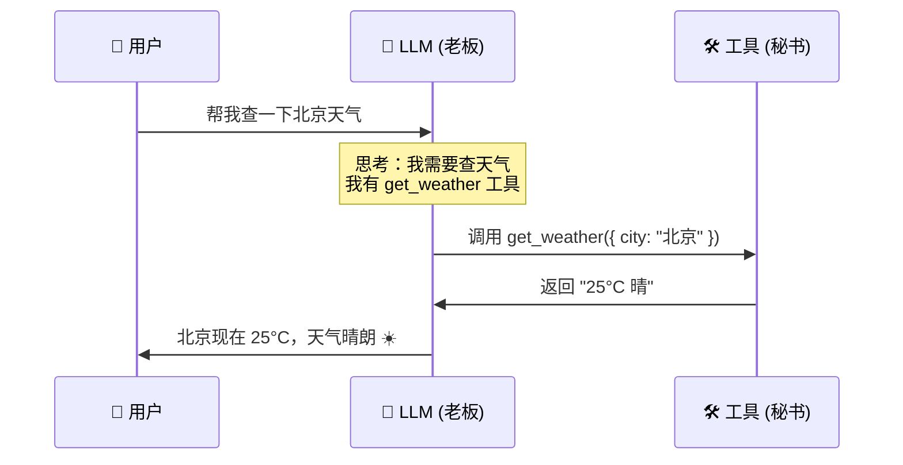
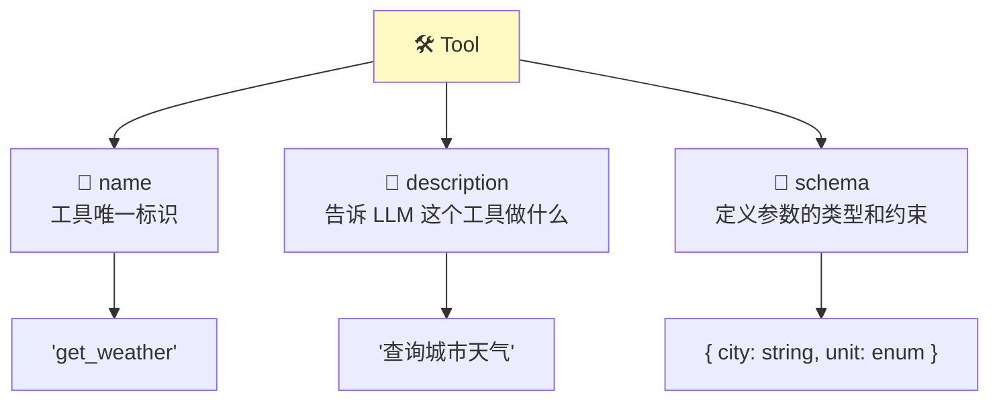
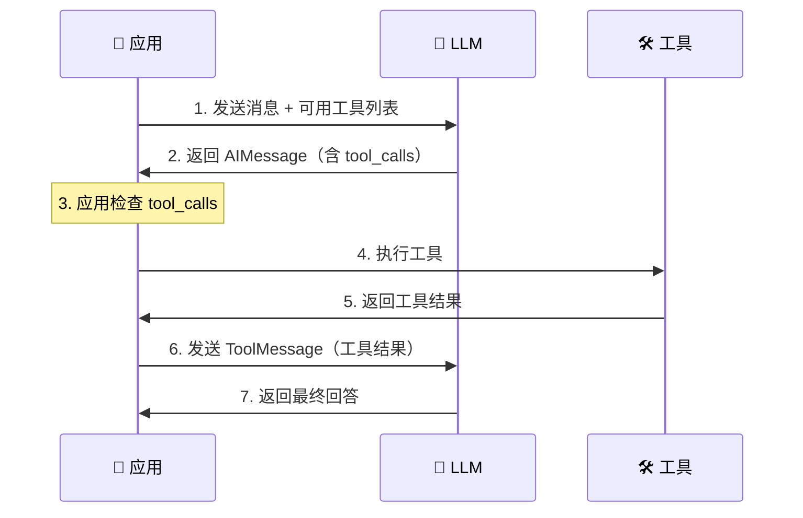

# 🛠️ 第 7 章：工具系统

> 让 LLM 能「做事」的工具调用机制

## 📌 本章目标

- 理解工具调用（Tool Calling）的原理
- 掌握创建自定义工具的方法
- 了解 Tool Calling 的完整流程
- 学会使用 Zod Schema 定义工具参数

---

## 7.1 🤔 为什么 LLM 需要工具？

### 问题

LLM 只会「说」，不会「做」：

```
用户: "北京现在几度？"
LLM:  "我无法获取实时天气信息，因为我的训练数据截止到..."  ← 😞
```

### 有了工具之后

```
用户: "北京现在几度？"
LLM:  → 决定调用 get_weather 工具
      → 工具返回: "北京 25°C 晴"
LLM:  "北京现在 25°C，天气晴朗。"  ← 🎉
```

### 🎯 类比：LLM + 工具 = 老板 + 秘书



**老板（LLM）** 负责理解需求、决策和组织回答；**秘书（工具）** 负责实际执行操作。

---

## 7.2 🔧 创建工具

> 📦 源码位置：`libs/langchain-core/src/tools/index.ts`

### 方式 1：使用 `tool` 函数（推荐 ✅）

```typescript
import { tool } from "@langchain/core/tools";
import { z } from "zod";

// 创建一个天气查询工具
const weatherTool = tool(
  // 工具的实际执行函数
  async ({ city, unit }) => {
    // 实际项目中这里会调用天气 API
    const mockData: Record<string, string> = {
      "北京": "25°C 晴",
      "上海": "28°C 多云",
      "广州": "32°C 阵雨",
    };
    return mockData[city] ?? `未找到 ${city} 的天气数据`;
  },
  {
    name: "get_weather",
    description: "查询指定城市的当前天气状况",
    schema: z.object({
      city: z.string().describe("城市名称，如'北京'"),
      unit: z.enum(["celsius", "fahrenheit"]).default("celsius")
        .describe("温度单位"),
    }),
  }
);

// 工具也是 Runnable，可以直接调用
const result = await weatherTool.invoke({ city: "北京", unit: "celsius" });
// result: "25°C 晴"
```

### 工具的三要素



💡 **description 非常重要！** LLM 通过 description 来决定什么时候使用这个工具。写得好不好直接影响工具调用的准确性。

### 方式 2：继承 StructuredTool 类

适合更复杂的工具，可以有内部状态：

```typescript
import { StructuredTool } from "@langchain/core/tools";
import { z } from "zod";

class DatabaseQueryTool extends StructuredTool {
  name = "query_database";
  description = "执行数据库查询，返回结果";
  
  schema = z.object({
    table: z.string().describe("表名"),
    conditions: z.record(z.string()).describe("查询条件"),
    limit: z.number().default(10).describe("返回数量限制"),
  });

  // 内部状态：数据库连接
  private db: Database;

  constructor(db: Database) {
    super();
    this.db = db;
  }

  // 实现核心方法
  async _call(input: z.infer<typeof this.schema>): Promise<string> {
    const results = await this.db.query(input.table, input.conditions, input.limit);
    return JSON.stringify(results);
  }
}

const dbTool = new DatabaseQueryTool(dbConnection);
```

---

## 7.3 📐 Zod Schema —— 工具参数的类型系统

### 为什么用 Zod？

Zod 是 TypeScript 的运行时类型验证库。用它定义工具参数有两个作用：

1. **告诉 LLM**：工具需要什么参数、什么类型、什么含义
2. **运行时验证**：确保 LLM 传入的参数符合要求

```typescript
import { z } from "zod";

// 复杂的参数定义示例
const searchSchema = z.object({
  query: z.string()
    .describe("搜索关键词"),
  
  maxResults: z.number()
    .min(1).max(50)
    .default(10)
    .describe("最大返回结果数"),
  
  category: z.enum(["news", "blog", "docs", "all"])
    .default("all")
    .describe("搜索分类"),
  
  dateRange: z.object({
    from: z.string().optional().describe("开始日期 YYYY-MM-DD"),
    to: z.string().optional().describe("结束日期 YYYY-MM-DD"),
  }).optional().describe("日期范围过滤"),
});
```

Schema 会被转换为 JSON Schema 格式发送给 LLM，LLM 据此生成正确的参数。

---

## 7.4 🔄 Tool Calling 完整流程

### 工作原理

Tool Calling 并不是 LLM 直接执行工具，而是一个**请求-执行-反馈**的循环：



### 代码实现

```typescript
import { HumanMessage, AIMessage, ToolMessage } from "@langchain/core/messages";

// 步骤 1: 将工具绑定到模型
const modelWithTools = model.bindTools([weatherTool, calculatorTool]);

// 步骤 2: 发送用户消息
const aiMessage = await modelWithTools.invoke([
  new HumanMessage("北京今天几度？如果加 5 度是多少？"),
]);

// 步骤 3: 检查 LLM 是否想调用工具
console.log(aiMessage.tool_calls);
// [
//   { id: "call_001", name: "get_weather", args: { city: "北京" } },
// ]

// 步骤 4: 执行工具并收集结果
const toolResults: ToolMessage[] = [];
for (const toolCall of aiMessage.tool_calls ?? []) {
  // 根据工具名找到对应的工具并执行
  const tool = [weatherTool, calculatorTool].find(
    (t) => t.name === toolCall.name
  );
  
  if (tool) {
    const result = await tool.invoke(toolCall.args);
    toolResults.push(
      new ToolMessage({
        content: result,
        tool_call_id: toolCall.id,
      })
    );
  }
}

// 步骤 5: 将工具结果反馈给 LLM
const finalResponse = await modelWithTools.invoke([
  new HumanMessage("北京今天几度？如果加 5 度是多少？"),
  aiMessage,          // LLM 的工具调用请求
  ...toolResults,     // 工具执行的结果
]);

console.log(finalResponse.content);
// "北京今天 25°C，加 5 度的话就是 30°C。"
```

### ⚠️ 关键理解

**LLM 不会直接执行工具！** 它只是告诉你「我想调用某某工具」，实际的执行由你的应用来完成。这就像老板说「帮我查一下」，但实际查资料的是秘书。

这个设计是有意的，因为：
1. **安全性**：你的应用控制着什么工具可以执行
2. **灵活性**：可以在执行前做验证、限流、审计
3. **可靠性**：工具执行失败时可以做错误处理

---

## 7.5 📊 ToolCall 的数据结构

```typescript
// AIMessage 中的 tool_calls 结构
interface ToolCall {
  id: string;                      // 调用 ID（用于匹配结果）
  name: string;                    // 工具名称
  args: Record<string, unknown>;   // 工具参数
}

// 示例
const aiMessage = new AIMessage({
  content: "",  // 有 tool_calls 时 content 通常为空
  tool_calls: [
    {
      id: "call_abc123",
      name: "get_weather",
      args: { city: "北京", unit: "celsius" },
    },
  ],
});

// ToolMessage 将结果与请求关联
const toolMessage = new ToolMessage({
  content: "25°C 晴",
  tool_call_id: "call_abc123",  // 必须与 ToolCall.id 匹配
});
```

---

## 7.6 🔧 实用工具示例

### 计算器工具

```typescript
const calculatorTool = tool(
  async ({ expression }) => {
    try {
      // 注意：实际生产中不要用 eval，这里仅作示例
      // 应使用 mathjs 等安全的数学表达式解析库
      const result = Function(`"use strict"; return (${expression})`)();
      return String(result);
    } catch {
      return "计算出错，请检查表达式";
    }
  },
  {
    name: "calculator",
    description: "计算数学表达式。输入数学表达式字符串，返回计算结果。",
    schema: z.object({
      expression: z.string().describe("数学表达式，如 '2 + 3 * 4'"),
    }),
  }
);
```

### HTTP 请求工具

```typescript
const httpTool = tool(
  async ({ url, method }) => {
    const response = await fetch(url, { method });
    const data = await response.json();
    return JSON.stringify(data);
  },
  {
    name: "http_request",
    description: "发送 HTTP 请求并返回 JSON 结果",
    schema: z.object({
      url: z.string().url().describe("请求 URL"),
      method: z.enum(["GET", "POST"]).default("GET").describe("HTTP 方法"),
    }),
  }
);
```

---

## 7.7 💡 工具设计最佳实践

### 1. 写好 description

```typescript
// ❌ 描述太模糊
{ description: "搜索功能" }

// ✅ 描述清晰、有边界
{ description: "在公司知识库中搜索技术文档。输入关键词，返回最相关的 5 篇文档摘要。不支持搜索人员信息。" }
```

### 2. 参数用 describe 注释

```typescript
// ❌ 没有 describe，LLM 只能靠猜
z.object({ q: z.string(), n: z.number() })

// ✅ 清晰的描述帮助 LLM 正确填写参数
z.object({
  query: z.string().describe("搜索关键词，支持中英文"),
  maxResults: z.number().min(1).max(20).describe("返回结果数量"),
})
```

### 3. 返回值要有意义

```typescript
// ❌ 返回 "success" 没有提供有用信息
return "success";

// ✅ 返回结构化的、LLM 能理解的信息
return JSON.stringify({
  status: "success",
  message: "订单已创建",
  orderId: "ORD-2024-001",
  estimatedDelivery: "2024-01-15",
});
```

### 4. 做好错误处理

```typescript
const safeTool = tool(
  async ({ query }) => {
    try {
      const result = await riskyOperation(query);
      return JSON.stringify(result);
    } catch (error) {
      // 返回错误信息而不是抛出异常
      // 让 LLM 知道出了什么问题，它可以决定下一步
      return `操作失败: ${(error as Error).message}。请尝试其他方式。`;
    }
  },
  { name: "safe_tool", description: "...", schema: z.object({ query: z.string() }) }
);
```

---

## 7.8 📝 本章小结

| 概念 | 要点 |
|------|------|
| **Tool** | 让 LLM 能调用外部函数的机制 |
| **tool()** | 创建工具的推荐方式 |
| **StructuredTool** | 面向对象方式创建复杂工具 |
| **Zod Schema** | 定义工具参数的类型和约束 |
| **Tool Calling** | LLM 生成调用请求，应用执行并反馈结果 |
| **ToolCall** | AIMessage 中的工具调用请求 |
| **ToolMessage** | 工具执行结果的消息类型 |

### 💡 核心收获

1. **工具让 LLM 能「做事」** —— 突破纯文本生成的限制
2. **LLM 不直接执行工具** —— 它只决定调用什么，执行由应用完成
3. **好的 description 和 schema 是关键** —— 直接影响工具调用的准确性
4. **工具也是 Runnable** —— 可以独立测试，也可以接入 pipe 链

---

> 📖 下一章：[🤖 第 8 章：智能体（Agent）](./08-agents.md) —— 把工具、模型和推理循环结合起来
