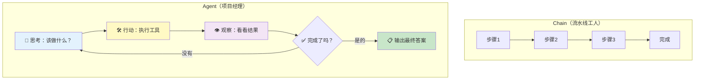
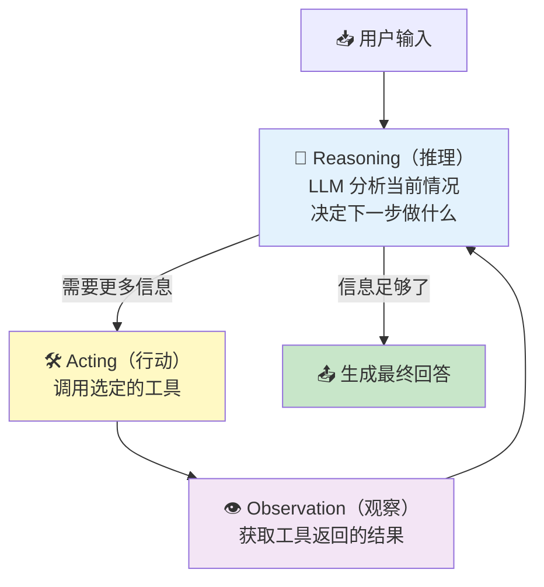
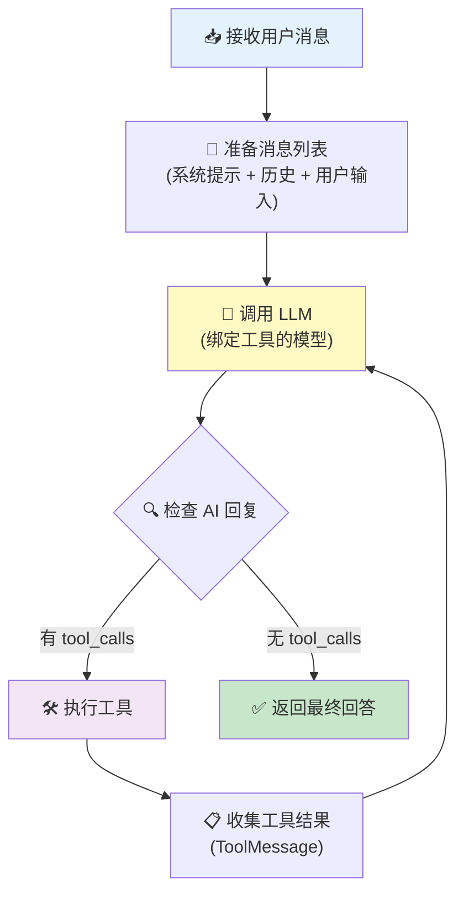
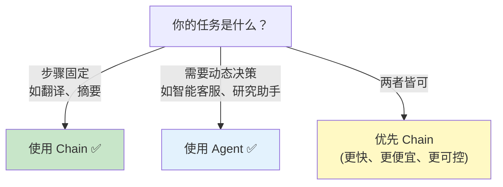

# 🤖 第 8 章：智能体（Agent）

> 把工具、模型和推理循环结合起来，创建能自主决策的智能系统

## 📌 本章目标

- 理解 Agent 的核心概念和工作原理
- 掌握 ReAct 推理模式
- 学会使用 `createAgent` 创建智能体
- 了解 Agent 的循环执行流程

---

## 8.1 🤔 什么是 Agent？

### Chain vs Agent

在前面的章节中，我们学习了 **Chain（链）**—— 组件按固定顺序执行。但有些任务没有固定的流程：

```
用户: "帮我规划一下明天北京的行程，考虑天气情况"
```

这个任务需要：
1. 先查天气 → 看看明天天气好不好
2. 根据天气结果 → 决定室内还是室外活动
3. 搜索景点信息 → 推荐合适的去处
4. 可能还需要查交通路线

**关键**：这些步骤的顺序和是否需要执行，取决于中间结果。这不是预设好的流水线，而是**动态决策**。

### 🎯 类比：Chain 是流水线工人，Agent 是项目经理



---

## 8.2 🔄 ReAct 模式

> 📦 源码位置：`libs/langchain/src/agents/ReactAgent.ts`

LangChain.js 的 Agent 基于 **ReAct（Reasoning + Acting）** 模式，这是一个「思考-行动-观察」的循环：

### ReAct 循环



### 一个完整的 ReAct 示例

假设用户问：「北京今天气温多少？如果超过 30 度，推荐几个室内景点」

```
🧠 思考: 用户想知道北京气温，还要根据气温推荐景点。先查天气。
🛠️ 行动: 调用 get_weather({ city: "北京" })
👁️ 观察: "北京 25°C 晴"

🧠 思考: 25°C 没有超过 30 度，不需要推荐室内景点，可以直接回答。
📤 回答: "北京今天 25°C，天气晴朗，没有超过 30 度，可以尽情享受户外活动！"
```

如果气温是 35°C：

```
🧠 思考: 用户想知道北京气温，还要根据气温推荐景点。先查天气。
🛠️ 行动: 调用 get_weather({ city: "北京" })
👁️ 观察: "北京 35°C 晴"

🧠 思考: 35°C 超过了 30 度，需要推荐室内景点。让我搜索一下。
🛠️ 行动: 调用 search({ query: "北京室内景点推荐" })
👁️ 观察: "故宫博物院、国家博物馆、798艺术区..."

🧠 思考: 现在有了天气和景点信息，可以生成完整回答。
📤 回答: "北京今天 35°C，天气较热。推荐以下室内景点：1. 故宫博物院..."
```

---

## 8.3 🚀 创建 Agent

> 📦 源码位置：`libs/langchain/src/agents/index.ts`

### 使用 createAgent

```typescript
import { createAgent } from "langchain/agents";
import { tool } from "@langchain/core/tools";
import { z } from "zod";

// 定义工具
const weatherTool = tool(
  async ({ city }) => {
    const data: Record<string, string> = {
      "北京": "25°C 晴", "上海": "28°C 多云", "广州": "32°C 阵雨"
    };
    return data[city] ?? `未找到 ${city} 的天气`;
  },
  {
    name: "get_weather",
    description: "查询指定城市的天气",
    schema: z.object({ city: z.string().describe("城市名称") }),
  }
);

const searchTool = tool(
  async ({ query }) => {
    return `搜索结果：关于"${query}"的相关信息...`;
  },
  {
    name: "search",
    description: "搜索互联网获取信息",
    schema: z.object({ query: z.string().describe("搜索关键词") }),
  }
);

// 创建 Agent
const agent = createAgent({
  // 使用 "provider:model" 格式指定模型
  model: "openai:gpt-4o",
  
  // 赋予 Agent 可用的工具
  tools: [weatherTool, searchTool],
  
  // 系统提示词：定义 Agent 的角色和行为
  prompt: "你是一个智能旅游助手，帮助用户规划旅行。请用中文回答。",
});

// 调用 Agent
const result = await agent.invoke({
  messages: [
    { role: "user", content: "帮我看看北京今天天气怎么样" },
  ],
});

console.log(result.messages); // 包含完整的对话历史和最终回答
```

---

## 8.4 🏗️ ReactAgent 内部架构

> 📦 源码位置：`libs/langchain/src/agents/ReactAgent.ts`

### 核心执行流程



### 简化的内部实现逻辑

```typescript
class ReactAgent {
  private model: BaseChatModel;
  private tools: StructuredTool[];
  private systemPrompt: string;

  async invoke(input: { messages: BaseMessage[] }) {
    const messages = [
      new SystemMessage(this.systemPrompt),
      ...input.messages,
    ];

    // 将工具绑定到模型
    const modelWithTools = this.model.bindTools(this.tools);

    // ReAct 循环
    while (true) {
      // 1️⃣ 调用 LLM
      const aiMessage = await modelWithTools.invoke(messages);
      messages.push(aiMessage);

      // 2️⃣ 检查是否有工具调用
      if (!aiMessage.tool_calls || aiMessage.tool_calls.length === 0) {
        // 没有工具调用 → 循环结束，返回最终回答
        break;
      }

      // 3️⃣ 执行每个工具调用
      for (const toolCall of aiMessage.tool_calls) {
        const tool = this.tools.find((t) => t.name === toolCall.name);
        if (tool) {
          const result = await tool.invoke(toolCall.args);
          messages.push(
            new ToolMessage({
              content: result,
              tool_call_id: toolCall.id,
            })
          );
        }
      }

      // 4️⃣ 回到循环顶部，带着工具结果再次调用 LLM
    }

    return { messages };
  }
}
```

---

## 8.5 🌊 Agent 的流式输出

Agent 支持流式输出，可以实时看到每一步的执行过程：

```typescript
const stream = await agent.stream({
  messages: [
    { role: "user", content: "查查北京和上海的天气" },
  ],
});

for await (const event of stream) {
  // event 包含不同类型的事件
  for (const [nodeName, output] of Object.entries(event)) {
    if (nodeName === "agent") {
      // LLM 的思考过程
      console.log("🧠 Agent 思考:", output);
    } else if (nodeName === "tools") {
      // 工具执行结果
      console.log("🛠️ 工具结果:", output);
    }
  }
}
```

---

## 8.6 📐 结构化输出的 Agent

Agent 也可以输出结构化数据，而不仅仅是文本：

```typescript
import { z } from "zod";

// 定义输出结构
const travelPlanSchema = z.object({
  destination: z.string().describe("目的地"),
  weather: z.string().describe("天气情况"),
  recommendations: z.array(
    z.object({
      name: z.string().describe("推荐景点/活动"),
      reason: z.string().describe("推荐理由"),
      duration: z.string().describe("建议游玩时长"),
    })
  ).describe("推荐列表"),
  tips: z.array(z.string()).describe("出行小贴士"),
});

const structuredAgent = createAgent({
  model: "openai:gpt-4o",
  tools: [weatherTool, searchTool],
  prompt: "你是旅游规划专家",
  responseFormat: travelPlanSchema,  // 指定输出格式
});

const plan = await structuredAgent.invoke({
  messages: [{ role: "user", content: "规划明天的北京一日游" }],
});
// plan.structuredResponse 是类型安全的 TravelPlan 对象
```

---

## 8.7 🔒 Agent 安全考量

### 最大迭代次数

防止 Agent 陷入无限循环：

```typescript
const agent = createAgent({
  model: "openai:gpt-4o",
  tools: [weatherTool],
  prompt: "你是一个助手",
  // 配置最大迭代次数，防止无限循环
});

// 也可以在调用时设置超时
const result = await agent.invoke(
  { messages: [{ role: "user", content: "..." }] },
  { timeout: 60000 } // 60 秒超时
);
```

### 工具执行权限控制

```typescript
// 敏感工具添加确认机制
const deleteToolWithGuard = tool(
  async ({ id }) => {
    // 在实际执行前进行权限检查
    if (!hasPermission(currentUser, "delete")) {
      return "权限不足，无法执行删除操作";
    }
    await database.delete(id);
    return `已删除记录 ${id}`;
  },
  {
    name: "delete_record",
    description: "删除数据库中的记录（需要管理员权限）",
    schema: z.object({ id: z.string() }),
  }
);
```

---

## 8.8 🧩 Agent vs Chain —— 如何选择？

| 维度 | Chain | Agent |
|------|-------|-------|
| **执行流程** | 固定的，预定义的 | 动态的，LLM 决定 |
| **使用工具** | 不使用或固定使用 | 根据需要选择 |
| **推理能力** | 无 | 有，能分析中间结果 |
| **可预测性** | 高 ⭐⭐⭐⭐⭐ | 中 ⭐⭐⭐ |
| **成本** | 低（调用次数固定） | 高（可能多次调用 LLM） |
| **适用场景** | 简单、确定的任务 | 复杂、需要决策的任务 |

### 选择建议



---

## 8.9 📝 本章小结

| 概念 | 要点 |
|------|------|
| **Agent** | 能自主决策使用工具的智能系统 |
| **ReAct** | 思考→行动→观察的循环模式 |
| **createAgent** | 创建 Agent 的工厂函数 |
| **ReactAgent** | LangChain.js 的核心 Agent 实现 |
| **tool_calls** | LLM 在回复中表达工具调用意图 |
| **循环终止** | 当 LLM 不再调用工具时循环结束 |
| **结构化输出** | Agent 可以按 schema 输出数据 |

### 💡 核心收获

1. **Agent 是 LLM + 工具 + 推理循环的结合体**
2. **ReAct 模式让 LLM 能够「思考-执行-反思」**
3. **Agent 的能力取决于模型能力和工具质量**
4. **简单任务用 Chain，复杂决策用 Agent**

---

> 📖 下一章：[📖 第 9 章：检索增强生成（RAG）](./09-rag.md) —— 让 LLM 基于你的私有数据回答问题
