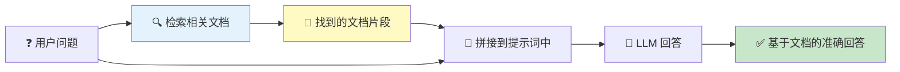
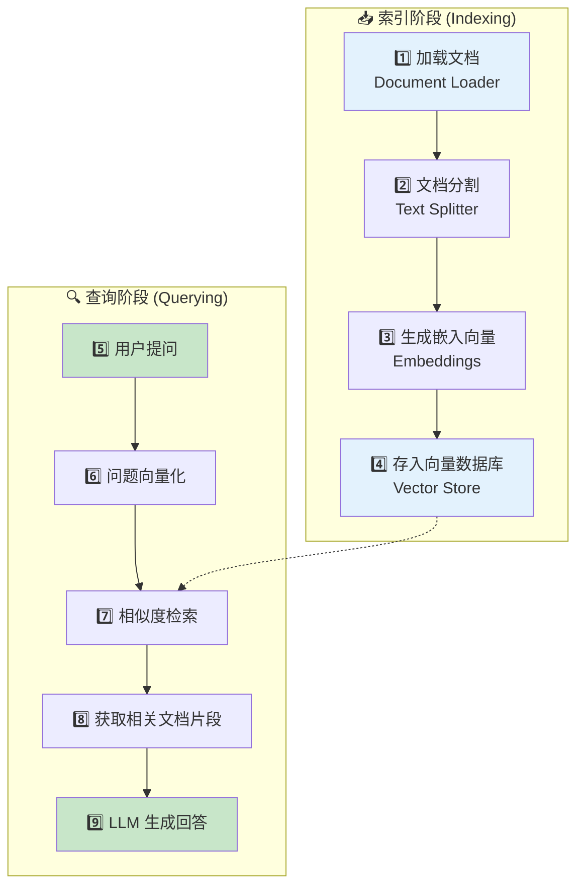
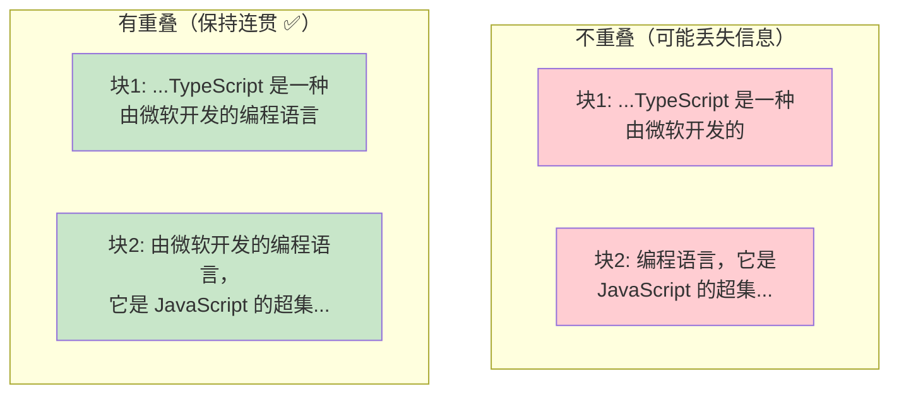
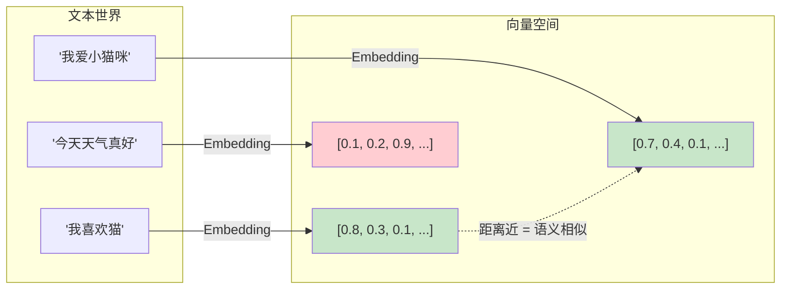
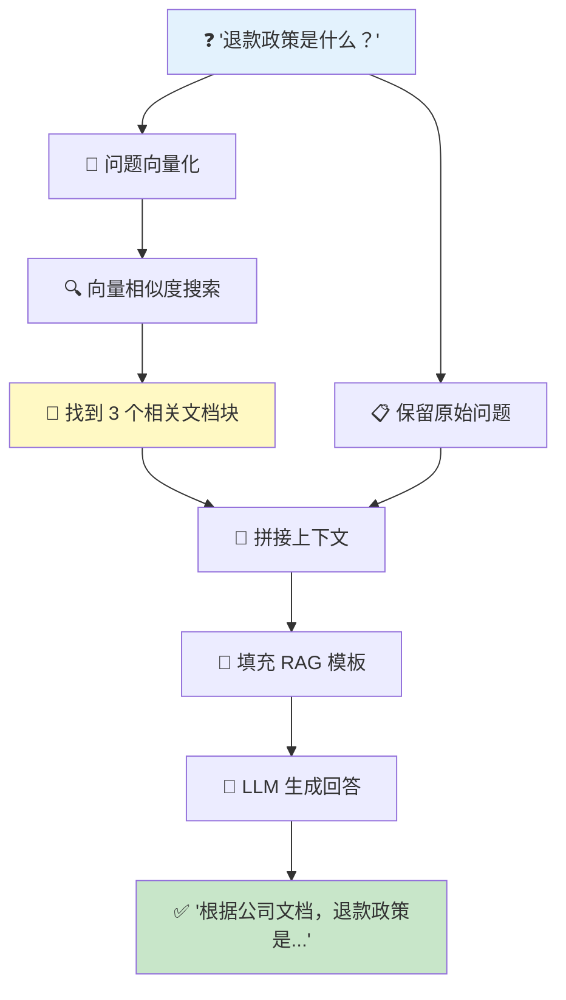

# 📖 第 9 章：检索增强生成（RAG）

> 让 LLM 基于你的私有数据回答问题

## 📌 本章目标

- 理解 RAG 的概念和为什么需要它
- 掌握文档加载、分割、嵌入、检索的完整流程
- 了解向量存储（Vector Store）的原理
- 学会构建一个基本的 RAG 管道

---

## 9.1 🤔 为什么需要 RAG？

### 问题：LLM 不知道你的私有数据

```
用户: "我们公司的退款政策是什么？"
LLM:  "抱歉，我不了解你们公司的具体政策..."  ← 😞
```

LLM 只知道训练数据中的知识。你公司的文档、产品手册、内部 Wiki —— 这些 LLM 都不知道。

### 两种解决方案

| 方案 | 原理 | 优点 | 缺点 |
|------|------|------|------|
| **微调 (Fine-tuning)** | 用你的数据重新训练模型 | 深度理解 | 昂贵、需要大量数据、更新慢 |
| **RAG** | 检索相关文档，拼接到提示词中 | 便宜、实时更新、无需训练 | 检索质量影响效果 |

### 🎯 类比：开卷考试 vs 闭卷考试

- **不用 RAG** = 闭卷考试：LLM 只能靠自己记住的知识回答
- **用了 RAG** = 开卷考试：LLM 可以翻阅相关资料后再回答



---

## 9.2 📋 RAG 完整流程

RAG 分为两个阶段：**索引阶段**（一次性）和 **查询阶段**（每次查询）



---

## 9.3 1️⃣ 文档加载（Document Loader）

> 📦 源码位置：`libs/langchain-core/src/document_loaders/base.ts`

Document Loader 负责从各种数据源加载文档：

```typescript
import { Document } from "@langchain/core/documents";

// Document 的结构
interface Document {
  pageContent: string;   // 文档内容
  metadata: Record<string, unknown>;  // 元数据（来源、页码等）
}
```

### 常见的 Document Loader

```typescript
// 从纯文本文件加载
// @langchain/community 提供了丰富的 Loader
import { TextLoader } from "langchain/document_loaders/fs/text";
const textDocs = await new TextLoader("./data/readme.txt").load();

// 从 PDF 加载
import { PDFLoader } from "@langchain/community/document_loaders/fs/pdf";
const pdfDocs = await new PDFLoader("./data/manual.pdf").load();

// 从网页加载
import { CheerioWebBaseLoader } from "@langchain/community/document_loaders/web/cheerio";
const webDocs = await new CheerioWebBaseLoader("https://example.com").load();

// 从 CSV 加载
import { CSVLoader } from "@langchain/community/document_loaders/fs/csv";
const csvDocs = await new CSVLoader("./data/products.csv").load();
```

### 🎯 类比

Document Loader 就像图书馆的「采购部门」—— 从各种渠道（出版社、网站、档案馆）获取书籍和资料。

---

## 9.4 2️⃣ 文档分割（Text Splitter）

> 📦 源码位置：`libs/langchain-textsplitters/`

### 为什么要分割？

LLM 有**上下文窗口限制**（比如 GPT-4o 是 128K tokens）。一份几万字的文档不能一次性塞给 LLM，需要先切成小块。

### 🎯 类比

就像你不会把整本字典塞给翻译官，而是只给他相关的几页。

```typescript
import { RecursiveCharacterTextSplitter } from "@langchain/textsplitters";

const splitter = new RecursiveCharacterTextSplitter({
  chunkSize: 1000,      // 每块最大 1000 个字符
  chunkOverlap: 200,    // 块之间重叠 200 个字符（保持上下文连贯）
});

const docs = await splitter.splitDocuments(loadedDocuments);
// 一篇 5000 字的文档 → 大约 6 个 chunk（因为有重叠）
```

### 为什么需要重叠（Overlap）？



重叠确保被切断的句子在相邻块中都能找到完整版本。

---

## 9.5 3️⃣ 嵌入向量（Embeddings）

> 📦 源码位置：`libs/langchain-core/src/embeddings.ts`

### 什么是 Embedding？

Embedding 是把文本转换成**数字向量**（一串数字）的过程。语义相似的文本会被转换成相近的向量。



### 🎯 类比

把 Embedding 想象成给每本书标注 GPS 坐标。内容相似的书在「语义地图」上的位置也很近，这样当你搜索时，就能快速找到「附近」的相关内容。

### 使用 Embedding

```typescript
import { OpenAIEmbeddings } from "@langchain/openai";

const embeddings = new OpenAIEmbeddings({
  model: "text-embedding-3-small",
});

// 嵌入单个文本（用于查询）
const queryVector = await embeddings.embedQuery("什么是 TypeScript？");
// queryVector: [0.023, -0.041, 0.078, ...] （1536 维向量）

// 嵌入多个文本（用于文档索引）
const docVectors = await embeddings.embedDocuments([
  "TypeScript 是 JavaScript 的超集",
  "Python 是一种解释型语言",
]);
// docVectors: [[0.021, ...], [0.055, ...]]
```

---

## 9.6 4️⃣ 向量存储（Vector Store）

> 📦 源码位置：`libs/langchain-core/src/vectorstores.ts`

### 什么是向量存储？

向量存储是一个专门用于存储和检索向量的数据库。它的核心能力是**相似度搜索** —— 找到与给定向量最接近的向量。

```typescript
import { MemoryVectorStore } from "langchain/vectorstores/memory";

// 创建向量存储（内存版，适合开发和测试）
const vectorStore = await MemoryVectorStore.fromDocuments(
  splitDocuments,  // 分割后的文档
  embeddings,      // 嵌入模型
);

// 相似度搜索
const results = await vectorStore.similaritySearch(
  "TypeScript 有什么优点？",
  3  // 返回最相关的 3 个文档块
);

// results: [
//   Document { pageContent: "TypeScript 提供了类型安全...", metadata: {...} },
//   Document { pageContent: "TypeScript 的优点包括...", metadata: {...} },
//   Document { pageContent: "与 JavaScript 相比...", metadata: {...} },
// ]
```

### 常见的 Vector Store

| 名称 | 类型 | 适用场景 |
|------|------|----------|
| `MemoryVectorStore` | 内存 | 开发测试、小数据量 |
| `@langchain/pinecone` | 云服务 | 生产环境、大规模 |
| `@langchain/weaviate` | 开源自托管 | 私有部署 |
| `@langchain/qdrant` | 开源自托管 | 高性能检索 |
| `@langchain/redis` | Redis | 已有 Redis 基础设施 |

### 转换为 Retriever

```typescript
// VectorStore 可以转换为 Retriever（也是 Runnable）
const retriever = vectorStore.asRetriever({
  k: 3,  // 每次检索返回 3 个结果
});

// Retriever 是 Runnable，可以直接 invoke
const docs = await retriever.invoke("TypeScript 的优点");
```

---

## 9.7 📐 构建完整的 RAG 管道

将上面所有步骤串联起来：

```typescript
import { ChatPromptTemplate } from "@langchain/core/prompts";
import { StringOutputParser } from "@langchain/core/output_parsers";
import { RunnablePassthrough, RunnableParallel } from "@langchain/core/runnables";

// 假设 vectorStore 已经索引了文档
const retriever = vectorStore.asRetriever({ k: 3 });

// RAG 提示词模板
const ragPrompt = ChatPromptTemplate.fromMessages([
  ["system", `你是一个知识库问答助手。请基于以下参考文档回答用户的问题。
如果文档中没有相关信息，请如实说"我在文档中没有找到相关信息"。

参考文档：
{context}`],
  ["human", "{question}"],
]);

// 构建 RAG 链
const ragChain = RunnableParallel.from({
  // 并行执行：检索文档 + 保留原始问题
  context: retriever.pipe(
    // 将文档列表转为文本
    (docs) => docs.map((d) => d.pageContent).join("\n\n---\n\n")
  ),
  question: new RunnablePassthrough(),
})
  .pipe(ragPrompt)
  .pipe(model)
  .pipe(new StringOutputParser());

// 使用 RAG
const answer = await ragChain.invoke("我们公司的退款政策是什么？");
// answer: "根据公司文档，退款政策如下：1. 购买后 30 天内可无理由退款..."
```

### RAG 链的执行流程



---

## 9.8 🎯 提升 RAG 质量的技巧

### 1. 优化文档分割

```typescript
// 针对不同文档类型使用不同的分割器
import { RecursiveCharacterTextSplitter } from "@langchain/textsplitters";

// Markdown 文档：按标题分割
const mdSplitter = RecursiveCharacterTextSplitter.fromLanguage("markdown", {
  chunkSize: 1000,
  chunkOverlap: 200,
});

// 代码文件：按函数/类分割
const codeSplitter = RecursiveCharacterTextSplitter.fromLanguage("js", {
  chunkSize: 2000,
  chunkOverlap: 200,
});
```

### 2. 添加元数据

```typescript
// 在文档中保留元数据，帮助追溯来源
const docs = splitDocuments.map((doc) => ({
  ...doc,
  metadata: {
    ...doc.metadata,
    source: "company_handbook",
    section: "refund_policy",
    lastUpdated: "2024-01-01",
  },
}));
```

### 3. 丰富检索策略

```typescript
// 最大边际相关性搜索（MMR）
// 在保证相关性的同时，增加结果的多样性
const results = await vectorStore.maxMarginalRelevanceSearch(
  "退款政策",
  {
    k: 5,           // 最终返回 5 个
    fetchK: 20,     // 先检索 20 个候选
    lambda: 0.5,    // 相关性 vs 多样性的平衡（0=最多样，1=最相关）
  }
);
```

---

## 9.9 📝 本章小结

| 概念 | 要点 |
|------|------|
| **RAG** | 检索增强生成，让 LLM 基于外部数据回答 |
| **Document Loader** | 从各种来源加载文档 |
| **Text Splitter** | 将长文档切成小块 |
| **Embedding** | 将文本转为数字向量 |
| **Vector Store** | 存储向量并支持相似度搜索 |
| **Retriever** | 检索相关文档的接口（Runnable） |
| **MMR** | 平衡相关性和多样性的检索策略 |

### 💡 核心收获

1. **RAG = 检索 + 生成**，让 LLM 「开卷考试」
2. **向量相似度是 RAG 的核心** —— 语义相似的文本有相似的向量
3. **文档分割的质量直接影响 RAG 效果**
4. **所有 RAG 组件都是 Runnable**，可以用 pipe 无缝组合
5. **生产环境需要持久化的 Vector Store**，如 Pinecone、Weaviate

---

> 📖 下一章：[👁️ 第 10 章：回调与可观测性](./10-callbacks-and-tracing.md) —— 追踪和调试你的 LLM 应用
