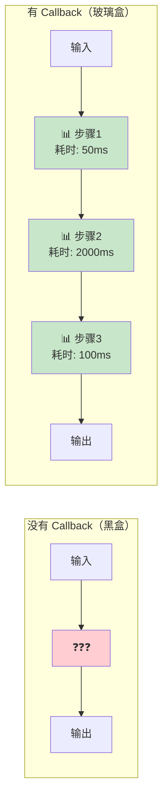
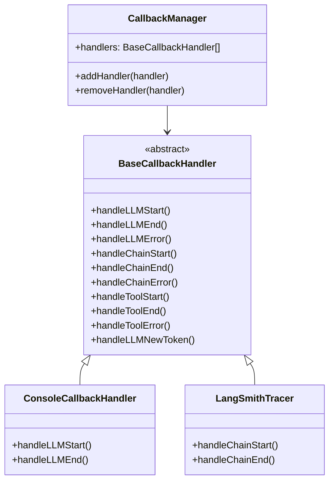
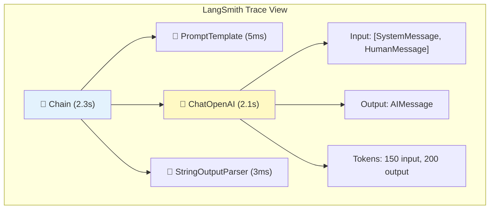

# 👁️ 第 10 章：回调与可观测性

> 追踪和调试你的 LLM 应用

## 📌 本章目标

- 理解 Callback 系统的设计和用途
- 掌握自定义 Callback Handler 的方法
- 了解 LangSmith 追踪集成
- 学会调试 LLM 应用

---

## 10.1 🤔 为什么需要 Callback？

### 问题

LLM 应用与传统 API 不同 —— 它的执行过程是**不透明的**：

- 链中有多少步？每步耗时多少？
- LLM 实际收到了什么 prompt？
- 工具调用了几次？参数是什么？
- 出错发生在哪一步？

### 🎯 类比：黑盒 vs 玻璃盒



Callback 系统让你在每个组件执行的**开始、结束、出错**时收到通知，就像给流水线的每个工位装了摄像头。

---

## 10.2 📐 Callback 系统架构

> 📦 源码位置：
> - `libs/langchain-core/src/callbacks/base.ts`
> - `libs/langchain-core/src/callbacks/manager.ts`

### 核心组件



### Callback 事件类型

| 事件 | 触发时机 | 主要用途 |
|------|----------|----------|
| `handleLLMStart` | LLM 开始调用时 | 记录请求、开始计时 |
| `handleLLMNewToken` | 流式输出每个 token | 实时显示、进度条 |
| `handleLLMEnd` | LLM 完成时 | 记录结果、统计耗时 |
| `handleLLMError` | LLM 调用失败时 | 错误报警、重试逻辑 |
| `handleChainStart` | 链开始执行时 | 追踪链路 |
| `handleChainEnd` | 链执行完毕时 | 记录结果 |
| `handleToolStart` | 工具调用开始时 | 审计工具使用 |
| `handleToolEnd` | 工具调用完毕时 | 记录工具结果 |

---

## 10.3 🔧 使用 Callback

### 方式 1：在调用时传入

```typescript
import { BaseCallbackHandler } from "@langchain/core/callbacks/base";

// 定义一个简单的日志 Callback
class LoggingHandler extends BaseCallbackHandler {
  name = "logging_handler";

  async handleLLMStart(llm: { name: string }, prompts: string[]) {
    console.log(`🚀 [LLM Start] 模型: ${llm.name}`);
    console.log(`📝 Prompt: ${prompts[0]?.substring(0, 100)}...`);
  }

  async handleLLMEnd(output: { generations: unknown[][] }) {
    console.log(`✅ [LLM End] 完成`);
  }

  async handleLLMError(error: Error) {
    console.error(`❌ [LLM Error] ${error.message}`);
  }

  async handleToolStart(
    tool: { name: string },
    input: string
  ) {
    console.log(`🛠️ [Tool Start] ${tool.name}, 输入: ${input}`);
  }

  async handleToolEnd(output: string) {
    console.log(`🛠️ [Tool End] 输出: ${output.substring(0, 100)}`);
  }
}

// 在调用时传入 callback
const result = await chain.invoke(
  { question: "什么是 TypeScript？" },
  {
    callbacks: [new LoggingHandler()],
  }
);

// 控制台输出：
// 🚀 [LLM Start] 模型: gpt-4o
// 📝 Prompt: 你是一个编程专家...
// ✅ [LLM End] 完成
```

### 方式 2：全局注册

```typescript
// 也可以通过 RunnableConfig 的 callbacks 字段传递
const configuredChain = chain.withConfig({
  callbacks: [new LoggingHandler()],
  tags: ["production"],
  metadata: { userId: "user_123" },
});
```

---

## 10.4 📊 实用的 Callback 示例

### 1. 性能监控

```typescript
class PerformanceHandler extends BaseCallbackHandler {
  name = "performance_handler";
  private timers: Map<string, number> = new Map();

  async handleLLMStart(
    llm: { name: string },
    _prompts: string[],
    runId: string
  ) {
    this.timers.set(runId, Date.now());
  }

  async handleLLMEnd(
    _output: unknown,
    runId: string
  ) {
    const startTime = this.timers.get(runId);
    if (startTime) {
      const duration = Date.now() - startTime;
      console.log(`⏱️ LLM 调用耗时: ${duration}ms`);
      
      // 慢查询告警
      if (duration > 5000) {
        console.warn(`⚠️ 慢调用告警！耗时 ${duration}ms`);
      }
      
      this.timers.delete(runId);
    }
  }
}
```

### 2. Token 使用统计

```typescript
class TokenUsageHandler extends BaseCallbackHandler {
  name = "token_usage_handler";
  totalTokens = 0;
  totalCost = 0;

  async handleLLMEnd(output: {
    llmOutput?: { tokenUsage?: { totalTokens?: number } };
  }) {
    const tokens = output.llmOutput?.tokenUsage?.totalTokens ?? 0;
    this.totalTokens += tokens;
    // 按 GPT-4o 的价格粗估
    this.totalCost += tokens * 0.000005;
    console.log(
      `💰 本次使用 ${tokens} tokens，累计 ${this.totalTokens} tokens，` +
      `估计费用: $${this.totalCost.toFixed(4)}`
    );
  }
}
```

### 3. 流式输出进度

```typescript
class StreamProgressHandler extends BaseCallbackHandler {
  name = "stream_progress";
  private charCount = 0;

  async handleLLMNewToken(token: string) {
    this.charCount += token.length;
    // 实时更新 UI（如进度条）
    process.stdout.write(token);
  }

  async handleLLMEnd() {
    console.log(`\n📊 总共生成 ${this.charCount} 个字符`);
  }
}
```

---

## 10.5 🔍 StreamEvents —— 细粒度事件流

> 📦 源码位置：`libs/langchain-core/src/tracers/event_stream.ts`

对于复杂的链，`streamEvents` 提供了更细粒度的事件追踪：

```typescript
const chain = prompt.pipe(model).pipe(parser);

const events = chain.streamEvents(
  { question: "什么是 LangChain？" },
  { version: "v2" }
);

for await (const event of events) {
  console.log(`[${event.event}] ${event.name}`);
  
  switch (event.event) {
    case "on_chain_start":
      console.log("  📥 链开始, 输入:", event.data.input);
      break;
    case "on_chat_model_stream":
      // 流式输出的 token
      process.stdout.write(event.data.chunk.content);
      break;
    case "on_chain_end":
      console.log("  📤 链结束, 输出:", event.data.output);
      break;
  }
}
```

### 事件结构

```typescript
interface StreamEvent {
  event: string;      // 事件类型
  name: string;       // 组件名称
  run_id: string;     // 运行 ID
  tags: string[];     // 标签
  metadata: object;   // 元数据
  data: {
    input?: unknown;  // 输入数据
    output?: unknown; // 输出数据
    chunk?: unknown;  // 流式块
  };
}
```

---

## 10.6 🔭 LangSmith 集成

LangSmith 是 LangChain 官方的可观测性平台，提供：

- 🔍 **追踪（Tracing）**：可视化查看每次调用的完整链路
- 📊 **监控（Monitoring）**：延迟、成功率、token 用量统计
- 🧪 **测试（Testing）**：创建测试数据集，评估 LLM 输出质量
- 🐛 **调试（Debugging）**：回放每次调用的输入/输出

### 启用 LangSmith

```bash
# 设置环境变量即可自动启用
export LANGSMITH_API_KEY="your-api-key"
export LANGSMITH_PROJECT="my-project"
export LANGSMITH_TRACING="true"  # 可选，默认启用
```

```typescript
// LangSmith 追踪是自动集成的
// 只要设置了环境变量，所有的 Runnable 调用都会被追踪
const result = await chain.invoke({ question: "什么是 TypeScript？" });
// 追踪数据会自动发送到 LangSmith 平台
```

### LangSmith 追踪视图



---

## 10.7 🐛 调试技巧

### 1. 使用 verbose 模式

```typescript
// 设置环境变量开启详细日志
// LANGCHAIN_VERBOSE=true

// 或在代码中使用 ConsoleCallbackHandler
import { ConsoleCallbackHandler } from "@langchain/core/tracers/console";

const result = await chain.invoke(
  { question: "测试" },
  { callbacks: [new ConsoleCallbackHandler()] }
);
```

### 2. 用 tags 标记不同场景

```typescript
// 用标签区分不同的调用来源，方便筛选和分析
const result = await chain.invoke(
  { question: "测试" },
  {
    tags: ["debug", "feature-x", "user-testing"],
    metadata: {
      userId: "test_user",
      environment: "staging",
    },
  }
);
```

### 3. 隔离测试单个组件

```typescript
// 不用运行整条链，单独测试某个组件
// 因为每个组件都是 Runnable！

// 单独测试 prompt
const promptResult = await prompt.invoke({
  question: "测试问题",
});
console.log("Prompt 输出:", promptResult);

// 单独测试 model
const modelResult = await model.invoke(promptResult);
console.log("Model 输出:", modelResult);

// 单独测试 parser
const parsed = await parser.invoke(modelResult);
console.log("Parser 输出:", parsed);
```

---

## 10.8 📝 本章小结

| 概念 | 要点 |
|------|------|
| **Callback** | 在组件执行的关键节点收到通知 |
| **BaseCallbackHandler** | 自定义回调的基类 |
| **CallbackManager** | 管理回调处理器的生命周期 |
| **StreamEvents** | 细粒度的事件流，追踪完整链路 |
| **LangSmith** | 官方可观测性平台 |
| **Tags & Metadata** | 标记和分类调用，便于分析 |

### 💡 核心收获

1. **Callback 是 LLM 应用的「眼睛」** —— 让不透明的 AI 过程变得可观察
2. **生产环境必须有监控** —— 追踪延迟、成本、错误率
3. **LangSmith 是最简单的追踪方案** —— 设置环境变量即可启用
4. **每个组件都可以独立测试** —— Runnable 接口让调试变得简单

---

> 📖 下一章：[⚡ 第 11 章：高级模式](./11-advanced-patterns.md) —— 流式处理、中间件、记忆管理等高级特性
