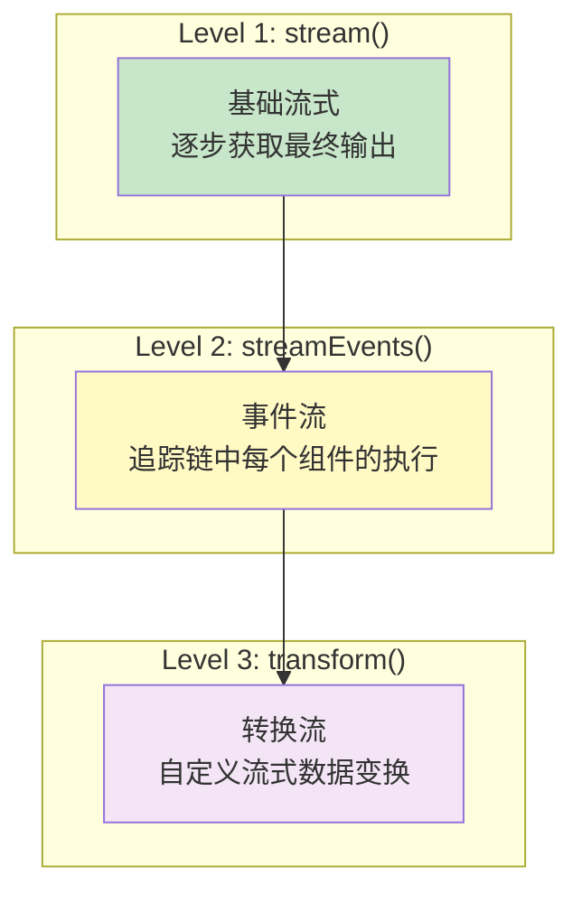
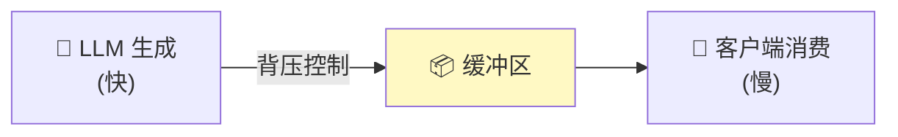
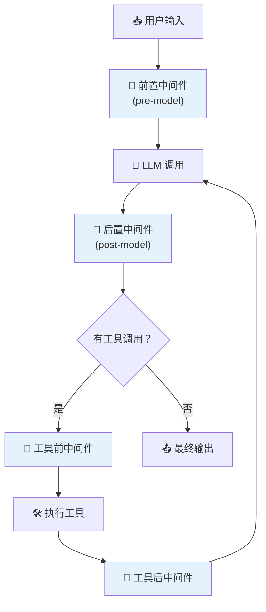
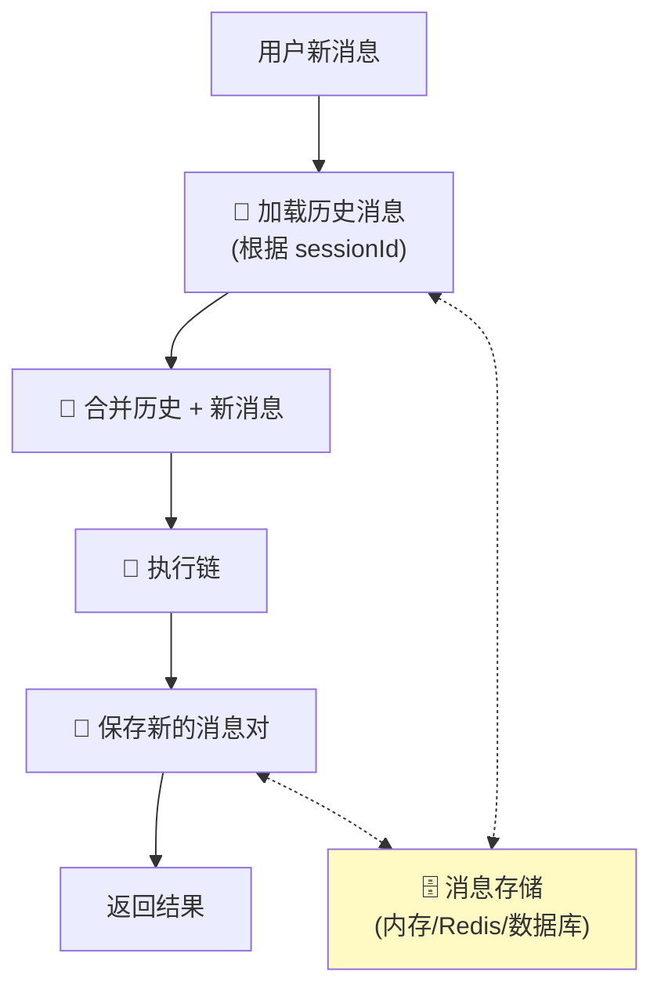
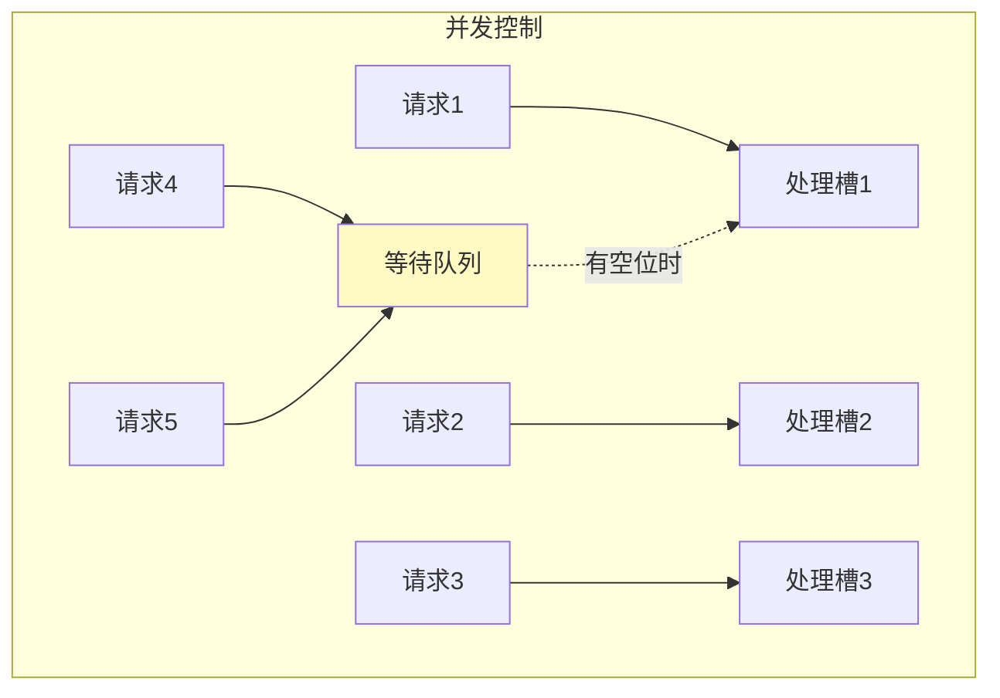

# ⚡ 第 11 章：高级模式

> 流式处理、中间件、记忆管理、并发控制等高级特性

## 📌 本章目标

- 深入理解流式处理的底层机制
- 掌握 Agent 中间件的使用
- 了解对话记忆的实现方式
- 学会并发控制和错误处理

---

## 11.1 🌊 流式处理深入

### 流式处理的三个层次



### Level 1: 基础 stream

```typescript
// 最简单的流式用法
const stream = await chain.stream({ question: "讲个故事" });

for await (const chunk of stream) {
  process.stdout.write(chunk);
}
```

### Level 2: streamEvents

```typescript
// 追踪整条链中每个组件的详细事件
const events = chain.streamEvents(
  { question: "讲个故事" },
  { version: "v2" }
);

for await (const event of events) {
  if (event.event === "on_chat_model_stream") {
    // 只关注模型的流式输出
    const content = event.data.chunk?.content;
    if (content) process.stdout.write(content);
  }
}
```

### Level 3: transform —— 自定义流式变换

```typescript
import { Runnable } from "@langchain/core/runnables";

// 创建一个自定义的流式变换器
// 比如：把英文输出实时转为大写
const uppercaseTransformer = new Runnable({
  async *transform(
    chunks: AsyncGenerator<string>
  ): AsyncGenerator<string> {
    for await (const chunk of chunks) {
      yield chunk.toUpperCase();
    }
  },
});

// 在链中使用
const chain = prompt.pipe(model).pipe(stringParser).pipe(uppercaseTransformer);
```

### 流式处理的背压控制



LangChain 的流式实现基于 `AsyncGenerator`，天然支持背压 —— 消费者没有消费完，生产者会自动等待。

---

## 11.2 🔌 Agent 中间件

> 📦 源码位置：`libs/langchain/src/agents/middleware.ts`

中间件让你可以在 Agent 执行的特定阶段插入自定义逻辑。

### 中间件的工作位置



### 使用中间件

```typescript
import { createAgent } from "langchain/agents";

const agent = createAgent({
  model: "openai:gpt-4o",
  tools: [weatherTool],
  prompt: "你是天气助手",
  
  // 前置中间件：在 LLM 调用前修改消息
  middleware: [
    {
      // 在每次 LLM 调用前执行
      preModelHook: async (state) => {
        console.log("📝 即将发送给 LLM 的消息数:", state.messages.length);
        // 可以修改 state.messages
        return state;
      },
      
      // 在每次 LLM 调用后执行
      postModelHook: async (state) => {
        console.log("✅ LLM 回复完成");
        return state;
      },
    },
  ],
});
```

### 实用中间件示例

#### 内容安全过滤

```typescript
const safetyMiddleware = {
  preModelHook: async (state: AgentState) => {
    const lastMessage = state.messages.at(-1);
    if (lastMessage && typeof lastMessage.content === "string") {
      // 检查用户输入是否包含敏感内容
      if (containsSensitiveContent(lastMessage.content)) {
        throw new Error("输入包含不当内容，已被过滤");
      }
    }
    return state;
  },
  postModelHook: async (state: AgentState) => {
    // 检查 AI 输出是否安全
    const aiMessage = state.messages.at(-1);
    if (aiMessage && typeof aiMessage.content === "string") {
      if (containsHarmfulContent(aiMessage.content)) {
        // 替换为安全回复
        aiMessage.content = "抱歉，我无法回答这个问题。";
      }
    }
    return state;
  },
};
```

#### 速率限制

```typescript
const rateLimitMiddleware = {
  preModelHook: async (state: AgentState) => {
    const now = Date.now();
    const timeSinceLastCall = now - lastCallTime;
    
    if (timeSinceLastCall < MIN_INTERVAL) {
      // 等待一段时间再调用
      await new Promise((r) => setTimeout(r, MIN_INTERVAL - timeSinceLastCall));
    }
    lastCallTime = Date.now();
    return state;
  },
};
```

---

## 11.3 🧠 对话记忆（Memory）

### 为什么需要记忆？

LLM 本身是**无状态的** —— 每次调用都是独立的，不记得之前的对话。

```
用户: "我叫小明"           → LLM: "你好小明！"
用户: "你还记得我叫什么吗？" → LLM: "抱歉，我不知道你叫什么"  ← 😞
```

### 🎯 类比：金鱼记忆 vs 正常记忆

没有 Memory 的 LLM 就像一条金鱼 —— 转个身就忘了一切。Memory 机制就是给 LLM 配了一个笔记本。

### RunnableWithMessageHistory

> 📦 源码位置：`libs/langchain-core/src/runnables/history.ts`

```typescript
import { RunnableWithMessageHistory } from "@langchain/core/runnables";
import { InMemoryChatMessageHistory } from "@langchain/core/chat_history";

// 创建一个消息历史存储
const messageHistories: Record<string, InMemoryChatMessageHistory> = {};

const getMessageHistory = (sessionId: string) => {
  if (!messageHistories[sessionId]) {
    messageHistories[sessionId] = new InMemoryChatMessageHistory();
  }
  return messageHistories[sessionId];
};

// 创建带记忆的链
const chainWithHistory = new RunnableWithMessageHistory({
  runnable: chain,                    // 原始链
  getMessageHistory,                  // 获取历史的函数
  inputMessagesKey: "input",          // 输入消息的 key
  historyMessagesKey: "chat_history", // 历史消息的 key
});

// 第一次对话
await chainWithHistory.invoke(
  { input: "我叫小明" },
  { configurable: { sessionId: "user_123" } }
);
// "你好小明！"

// 第二次对话（同一个 session）
await chainWithHistory.invoke(
  { input: "你还记得我叫什么吗？" },
  { configurable: { sessionId: "user_123" } }
);
// "当然记得，你叫小明！" ← 🎉
```

### 记忆的工作原理



---

## 11.4 🔄 并发与批量处理

### batch 的并发控制

```typescript
// 批量处理 100 个问题，但限制并发数为 5
const results = await chain.batch(
  questions.map((q) => ({ question: q })),
  {
    maxConcurrency: 5,   // 最多 5 个并发请求
    returnExceptions: true, // 出错时返回异常而非抛出
  }
);

// 检查结果
results.forEach((result, i) => {
  if (result instanceof Error) {
    console.error(`问题 ${i} 处理失败:`, result.message);
  } else {
    console.log(`问题 ${i} 结果:`, result);
  }
});
```

### 🎯 类比：餐厅服务

- `maxConcurrency: 1` = 一次只能接待一桌客人
- `maxConcurrency: 5` = 最多同时服务 5 桌
- `maxConcurrency: Infinity` = 来多少接多少（可能服务质量下降）



---

## 11.5 🛡️ 错误处理与容错

### withRetry —— 自动重试

```typescript
const reliableChain = chain.withRetry({
  stopAfterAttempt: 3,
  onFailedAttempt: (error, attempt) => {
    console.warn(`第 ${attempt} 次尝试失败: ${error.message}`);
    if (attempt >= 3) {
      console.error("已达最大重试次数，放弃");
    }
  },
});
```

### withFallbacks —— 降级方案

```typescript
// 主链失败时，自动切换到备用链
const primaryChain = prompt.pipe(gpt4Model).pipe(parser);
const fallbackChain = prompt.pipe(gpt35Model).pipe(parser);
const cheapFallback = prompt.pipe(localModel).pipe(parser);

const resilientChain = primaryChain.withFallbacks({
  fallbacks: [fallbackChain, cheapFallback],
});

// 先试 GPT-4，失败试 GPT-3.5，再失败试本地模型
const result = await resilientChain.invoke({ question: "..." });
```

### 超时控制

```typescript
// 使用 AbortController 控制超时
const controller = new AbortController();
const timeout = setTimeout(() => controller.abort(), 30000); // 30 秒超时

try {
  const result = await chain.invoke(
    { question: "..." },
    { signal: controller.signal }
  );
} catch (error) {
  if ((error as Error).name === "AbortError") {
    console.error("请求超时！");
  }
} finally {
  clearTimeout(timeout);
}
```

---

## 11.6 🔄 序列化与持久化

> 📦 源码位置：`libs/langchain-core/src/load/serializable.ts`

LangChain 的组件继承自 `Serializable`，支持序列化和反序列化：

```typescript
// 所有 Runnable 组件都支持序列化
const serialized = chain.toJSON();
// serialized 是一个 JSON 对象，描述了链的结构

// 序列化的用途：
// 1. 将链的定义存储到数据库
// 2. 在不同服务之间传递链的配置
// 3. 版本控制链的定义
```

---

## 11.7 📊 性能优化建议

### 1. 合理使用缓存

```typescript
// LLM 调用缓存 —— 相同的输入返回缓存结果
import { InMemoryCache } from "@langchain/core/caches";

const cachedModel = new ChatOpenAI({
  model: "gpt-4o",
  cache: new InMemoryCache(),
});

// 第一次调用：走 API（2秒）
await cachedModel.invoke("什么是 TypeScript？");

// 第二次相同调用：走缓存（<1ms）
await cachedModel.invoke("什么是 TypeScript？");
```

### 2. 选择合适的模型

```typescript
// 简单任务用小模型，复杂任务用大模型
const simpleModel = new ChatOpenAI({ model: "gpt-4o-mini" }); // 便宜快速
const powerModel = new ChatOpenAI({ model: "gpt-4o" });       // 更强但更贵

// 根据任务复杂度动态选择
const router = RunnableBranch.from([
  [(input) => input.complexity === "high", powerModel],
  simpleModel, // 默认用小模型
]);
```

### 3. 使用流式减少首字延迟

```typescript
// 流式输出可以显著降低用户感知的延迟
// 虽然总时间不变，但用户能更快看到第一个字
const stream = await model.stream("写一篇文章...");
for await (const chunk of stream) {
  // 用户立即开始看到输出
  updateUI(chunk.content);
}
```

---

## 11.8 📝 本章小结

| 概念 | 要点 |
|------|------|
| **流式处理** | 三个层次：stream / streamEvents / transform |
| **中间件** | 在 Agent 执行的特定阶段插入自定义逻辑 |
| **Memory** | 通过 RunnableWithMessageHistory 实现对话记忆 |
| **并发控制** | maxConcurrency 限制批量调用的并发数 |
| **错误处理** | withRetry（重试）+ withFallbacks（降级） |
| **缓存** | 相同输入复用之前的结果 |
| **超时** | 使用 AbortSignal 控制请求超时 |

### 💡 核心收获

1. **流式处理是提升用户体验的关键** —— 减少感知延迟
2. **中间件让 Agent 更安全可控** —— 添加过滤、限流、审计
3. **记忆管理是构建对话系统的基础** —— 让 LLM 「记住」之前的对话
4. **容错设计必不可少** —— API 调用不可靠，必须有重试和降级

---

> 📖 下一章：[🏗️ 第 12 章：项目架构解析](./12-project-architecture.md) —— 深入了解 LangChain.js 仓库的工程实现
