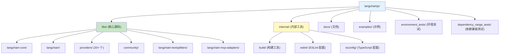
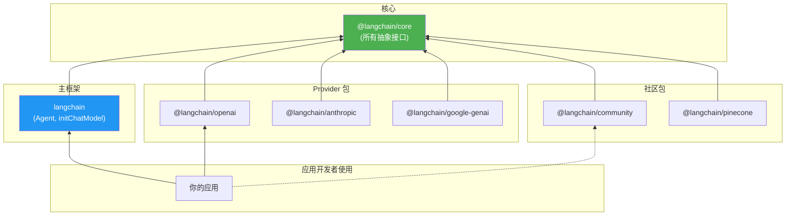
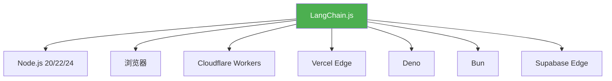
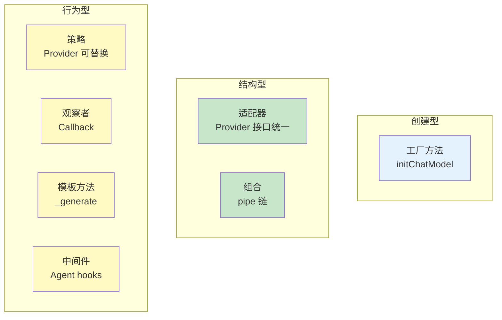

# 🏗️ 第 12 章：项目架构解析

> 深入了解 LangChain.js 仓库的工程实现，从源码层面理解框架

## 📌 本章目标

- 理解 Monorepo 的组织结构和工程实践
- 掌握各个包之间的依赖关系
- 了解构建系统和开发工具链
- 学会阅读源码和参与贡献

---

## 12.1 📁 仓库整体结构



### 目录说明

| 目录 | 用途 | 关键文件 |
|------|------|----------|
| `libs/langchain-core/` | 核心抽象和接口 | Runnable, Messages, BaseChatModel |
| `libs/langchain/` | 主框架包 | Agent, initChatModel |
| `libs/providers/` | LLM 提供商集成 | ChatOpenAI, ChatAnthropic 等 |
| `libs/community/` | 社区贡献的集成 | 文档加载器、向量存储等 |
| `internal/` | 内部工具和配置 | 构建脚本、ESLint 规则、TS 配置 |
| `docs/` | 文档网站源码 | 教程、API 参考 |
| `examples/` | 使用示例 | 各种场景的完整示例 |

---

## 12.2 🧬 核心包源码结构

### @langchain/core 目录结构

这是整个框架的基石，让我们看看它的内部组织：

```
libs/langchain-core/src/
├── runnables/              # ⚙️ Runnable 接口和实现
│   ├── base.ts            # 核心 Runnable 类 (111KB)
│   ├── types.ts           # 类型定义
│   ├── config.ts          # RunnableConfig
│   ├── branch.ts          # RunnableBranch (条件路由)
│   ├── passthrough.ts     # RunnablePassthrough (透传)
│   ├── router.ts          # RunnableRouter (动态路由)
│   ├── history.ts         # RunnableWithMessageHistory (记忆)
│   └── graph.ts           # 可视化
│
├── messages/               # 💬 消息类型系统
│   ├── base.ts            # BaseMessage
│   ├── ai.ts              # AIMessage, AIMessageChunk
│   ├── human.ts           # HumanMessage
│   ├── system.ts          # SystemMessage
│   ├── tool.ts            # ToolMessage
│   ├── chat.ts            # ChatMessage
│   ├── transformers.ts    # 消息转换工具
│   └── block_translators/ # 多模态内容转换器
│
├── language_models/        # 🤖 语言模型基类
│   ├── base.ts            # BaseLanguageModel
│   ├── chat_models.ts     # BaseChatModel (35KB)
│   ├── llms.ts            # BaseLLM
│   └── profile.ts         # ModelProfile (模型能力描述)
│
├── prompts/                # 📝 提示词模板
│   ├── base.ts            # BasePromptTemplate
│   ├── chat.ts            # ChatPromptTemplate (38KB)
│   ├── prompt.ts          # PromptTemplate
│   ├── few_shot.ts        # FewShotPromptTemplate
│   └── template.ts        # 模板引擎
│
├── tools/                  # 🛠️ 工具系统
│   ├── index.ts           # StructuredTool, DynamicTool
│   └── types.ts           # 工具类型定义
│
├── output_parsers/         # 🔧 输出解析器
│   ├── base.ts            # BaseOutputParser
│   ├── string.ts          # StringOutputParser
│   ├── json.ts            # JsonOutputParser
│   ├── xml.ts             # XMLOutputParser
│   ├── structured.ts      # StructuredOutputParser
│   └── list.ts            # ListOutputParser
│
├── callbacks/              # 👁️ 回调系统
│   ├── base.ts            # BaseCallbackHandler
│   ├── manager.ts         # CallbackManager (39KB)
│   └── dispatch/          # 事件分发
│
├── vectorstores.ts         # 📊 向量存储基类 (36KB)
├── embeddings.ts           # 🔢 嵌入模型接口
├── retrievers/             # 🔍 检索器
│   └── index.ts           # BaseRetriever
├── document_loaders/       # 📄 文档加载器基类
│   └── base.ts            # BaseDocumentLoader
├── documents/              # 📃 文档类型
│   └── index.ts           # Document
│
├── tracers/                # 📈 追踪器
│   ├── log_stream.ts      # LogStreamCallbackHandler
│   ├── event_stream.ts    # EventStreamCallbackHandler
│   └── console.ts         # ConsoleCallbackHandler
│
├── caches/                 # 💾 缓存
├── stores.ts               # 🗄️ 存储接口
├── memory.ts               # 🧠 记忆接口
├── outputs.ts              # 📤 输出类型 (LLMResult, ChatResult)
└── load/                   # 📦 序列化/反序列化
    └── serializable.ts    # Serializable 基类
```

---

## 12.3 🔗 包之间的依赖关系



### 依赖规则

1. **`@langchain/core` 是最底层的包**，不依赖任何其他 LangChain 包
2. **Provider 包** 只依赖 `@langchain/core`（`peerDependency`）
3. **`langchain` 主包** 依赖 `@langchain/core`
4. **社区包** 只依赖 `@langchain/core`
5. **不存在循环依赖**

### 为什么这样设计？

```typescript
// ✅ 正确的依赖方向
// @langchain/openai 的 package.json
{
  "peerDependencies": {
    "@langchain/core": "^1.0.0"  // 只依赖 core
  }
}

// ❌ 错误：Provider 之间不应该互相依赖
// @langchain/openai 不应该依赖 @langchain/anthropic
```

这种设计确保了：
- **可选安装**：只装需要的 Provider
- **独立版本**：各包可以独立发布
- **无膨胀**：不会因为用了 OpenAI 而被迫装上 Anthropic 的 SDK

---

## 12.4 🛠️ 开发工具链

### 技术栈概览

| 工具 | 版本 | 用途 |
|------|------|------|
| **pnpm** | 10.14.0 | 包管理器（Monorepo workspace） |
| **Turborepo** | - | 构建编排（并行构建、缓存） |
| **TypeScript** | - | 开发语言 |
| **Vitest** | - | 测试框架 |
| **ESLint** | - | 代码检查 |
| **tsdown** | - | 打包构建 |

### TypeScript 配置

> 📦 源码位置：`internal/tsconfig/base.json`

```json
{
  "compilerOptions": {
    "target": "ES2022",
    "module": "ESNext",
    "moduleResolution": "bundler",
    "strict": true,
    "declaration": true,
    "declarationMap": true,
    "sourceMap": true,
    "esModuleInterop": true,
    "skipLibCheck": true
  }
}
```

关键配置说明：
- **target: ES2022** —— 使用现代 JavaScript 特性
- **module: ESNext** —— ESM 模块系统
- **strict: true** —— 严格类型检查
- **declaration: true** —— 生成 `.d.ts` 类型声明文件

### ESLint 规则

> 📦 源码位置：`internal/eslint/src/configs/base.ts`

LangChain.js 有一些特殊的 ESLint 规则：

```typescript
// 规则 1: 禁止使用 instanceof ❌
// 原因：跨包时 instanceof 可能失效（不同版本的类）
if (message instanceof AIMessage) { }  // ❌
AIMessage.isInstance(message);          // ✅

// 规则 2: 禁止直接使用 process.env ❌
// 原因：浏览器和 Edge 环境没有 process
process.env.OPENAI_API_KEY;  // ❌
getEnvironmentVariable("OPENAI_API_KEY");  // ✅

// 规则 3: 必须处理 Promise ❌
someAsyncFunction();       // ❌ (floating promise)
await someAsyncFunction(); // ✅

// 规则 4: import 必须带文件扩展名 ❌
import { X } from "./module";     // ❌
import { X } from "./module.js";  // ✅ (ESM 要求)
```

---

## 12.5 📋 测试体系

### 测试类型

```
tests/
├── *.test.ts              # 单元测试（不需要 API Key）
├── *.int.test.ts          # 集成测试（需要真实 API）
├── *.test-d.ts            # 类型测试（TypeScript 类型检查）
└── *.standard.test.ts     # 标准测试（统一的 Provider 测试套件）
```

### 运行测试

```bash
# 运行单元测试
pnpm --filter @langchain/core test

# 运行特定测试文件
pnpm --filter @langchain/core test src/messages/tests/utils.test.ts

# 运行集成测试（需要 API Key）
pnpm --filter @langchain/openai test:integration

# 运行类型测试
pnpm --filter @langchain/core test:type
```

### 标准测试（Standard Tests）

> 📦 源码位置：`libs/langchain-standard-tests/`

LangChain.js 有一套**标准测试**，所有 Provider 都应该通过：

```typescript
import { ChatModelUnitTests } from "@langchain/standard-tests";

class MyChatModelTests extends ChatModelUnitTests<
  MyChatModelCallOptions,
  AIMessageChunk
> {
  constructor() {
    super({
      Cls: MyChatModel,
      chatModelHasToolCalling: true,
      chatModelHasStructuredOutput: true,
      constructorArgs: { model: "my-model" },
    });
  }
}

// 自动运行所有标准测试用例
const testClass = new MyChatModelTests();
testClass.runTests();
```

这确保了所有 Provider 的行为一致性。

---

## 12.6 🏭 构建流程

### 构建命令

```bash
# 构建单个包
pnpm --filter @langchain/core build

# 构建所有包（Turborepo 自动处理依赖顺序）
pnpm build

# 开发模式（监听文件变化）
pnpm --filter @langchain/core watch
```

### 构建产物

```
dist/
├── index.js          # ESM 格式
├── index.cjs         # CommonJS 格式
├── index.d.ts        # TypeScript 声明
└── index.d.cts       # CJS 的 TypeScript 声明
```

同时支持 **ESM** 和 **CommonJS** 两种模块格式，确保在各种环境中都能使用。

---

## 12.7 🌍 多环境支持

LangChain.js 需要在多种环境下运行：



### 环境兼容的设计考量

```typescript
// 1. 不能用 Node.js 特有的 API
// ❌ process.env, fs, path 等
// ✅ 使用 LangChain 的环境工具
import { getEnvironmentVariable } from "@langchain/core/utils/env";

// 2. 不能用 eval 或 new Function
// 某些边缘环境禁止动态代码执行

// 3. 使用 Web 标准 API
// ✅ fetch (而不是 node-fetch)
// ✅ Web Streams (而不是 Node.js streams)
// ✅ TextEncoder/TextDecoder
```

> 📦 环境测试位于 `environment_tests/` 目录

---

## 12.8 🤝 如何参与贡献

### 1. 开发环境准备

```bash
# 克隆仓库
git clone https://github.com/langchain-ai/langchainjs.git
cd langchainjs

# 安装依赖
pnpm install

# 构建核心包
pnpm --filter @langchain/core build
```

### 2. 开发流程

```bash
# 创建功能分支
git checkout -b feature/my-feature

# 修改代码...

# 检查代码风格
pnpm --filter @langchain/core lint

# 运行测试
pnpm --filter @langchain/core test

# 格式化代码
pnpm --filter @langchain/core format

# 提交代码
git commit -m "feat: add my feature"
```

### 3. PR 检查清单

- [ ] 代码通过 `pnpm lint`
- [ ] 代码通过 `pnpm format:check`
- [ ] 添加/更新了单元测试
- [ ] 添加/更新了集成测试（如果涉及 API）
- [ ] 添加/更新了类型测试（如果改变了公共 API）
- [ ] 更新了文档
- [ ] 没有引入循环依赖

### 4. 创建新的 Provider 包

```bash
# 使用脚手架工具
npx create-langchain-integration

# 按照提示填写：
# - 包名
# - 支持的功能（Chat Model, Embeddings, Vector Store）
# - Provider 的 API 信息
```

---

## 12.9 🧩 设计模式总结

回顾整个 LangChain.js 项目中使用的关键设计模式：

| 模式 | 应用 | 原因 |
|------|------|------|
| **接口隔离** | Runnable 接口 | 统一所有组件的调用方式 |
| **模板方法** | BaseChatModel._generate | Provider 只需实现核心方法 |
| **策略模式** | Provider 可替换 | 切换不同的 LLM 不影响业务代码 |
| **组合模式** | pipe 链式调用 | 用小组件组合出复杂功能 |
| **观察者模式** | Callback 系统 | 解耦核心逻辑和监控/日志 |
| **工厂方法** | initChatModel, createAgent | 统一的创建入口 |
| **中间件模式** | Agent middleware | 可插拔的处理逻辑 |
| **适配器模式** | block_translators | 不同 Provider 消息格式转换 |



---

## 12.10 📝 本章小结

| 概念 | 要点 |
|------|------|
| **Monorepo** | pnpm workspace + Turborepo 管理 |
| **核心包** | @langchain/core 定义所有抽象接口 |
| **Provider 包** | 独立安装，只依赖 core |
| **构建** | 同时输出 ESM + CJS |
| **测试** | 单元 / 集成 / 类型 / 标准 四种测试 |
| **多环境** | 支持 Node.js / Browser / Edge 等 |
| **ESLint** | 禁止 instanceof、process.env 等 |

### 💡 核心收获

1. **分层架构保证了可扩展性** —— 核心稳定，Provider 可快速迭代
2. **严格的 ESLint 规则保障代码质量** —— 如禁用 instanceof
3. **标准测试确保 Provider 行为一致** —— 所有 Provider 通过同一套测试
4. **多环境支持需要额外考量** —— 避免使用环境特有 API

---

## 🎉 教程完结

恭喜你完成了 LangChain.js 的完整学习之旅！

### 🗺️ 回顾学习路线


### 📚 推荐的下一步

1. **动手实践**：基于教程中的代码示例，构建自己的 LLM 应用
2. **阅读源码**：从 `@langchain/core/runnables/base.ts` 开始深入源码
3. **参与社区**：提交 Issue、贡献 PR、在 Forum 中交流
4. **关注更新**：LangChain 迭代很快，持续关注新特性

---

> 📖 返回 [教程首页](./README.md) | 🔗 [LangChain.js 官方文档](https://js.langchain.com) | 💬 [LangChain 社区论坛](https://forum.langchain.com)
