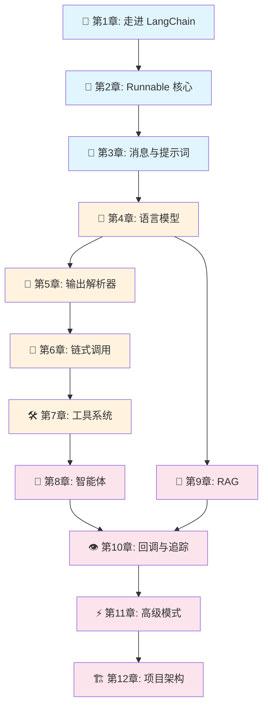

# 📚 LangChain.js 学习教程

> 🎯 由浅入深，系统学习 LangChain.js —— 用 TypeScript 构建 LLM 驱动的智能应用

## 🌟 教程简介

本教程基于 [LangChain.js](https://github.com/langchain-ai/langchainjs) 源码，带你从零开始理解 LangChain 的设计思想、核心架构和实际用法。无论你是 LLM 应用开发的新手，还是想深入理解框架内部原理的开发者，都能在这里找到适合自己的内容。

### 🤔 为什么要学 LangChain？

想象一下，你有一个超级聪明的助手（大语言模型），但它：
- 🧠 只会「说话」，不会「做事」（无法调用 API、查数据库）
- 📝 只能处理纯文本，不懂结构化数据
- 🔄 没有记忆，每次对话都从头开始
- 🎯 输出不可控，难以集成到业务系统

**LangChain 就是解决这些问题的框架** —— 它提供了一套标准化的接口和工具，让你能够：
- 将 LLM 与外部工具（搜索引擎、数据库、API）连接起来
- 用结构化的方式管理对话、提示词和输出
- 构建有记忆、能推理、会使用工具的智能体（Agent）
- 实现检索增强生成（RAG），让 LLM 基于你的私有数据回答问题

## 📖 目录

### 🌱 入门篇

| 章节 | 标题 | 内容概要 |
|------|------|----------|
| [第 1 章](./01-introduction.md) | 🚀 走进 LangChain | LangChain 是什么、为什么需要它、整体架构概览 |
| [第 2 章](./02-core-concepts.md) | 🧱 核心概念：Runnable 接口 | LangChain 的「万物基石」—— Runnable 设计模式 |
| [第 3 章](./03-messages-and-prompts.md) | 💬 消息与提示词模板 | 消息类型、提示词模板、Few-shot 学习 |

### 🌿 进阶篇

| 章节 | 标题 | 内容概要 |
|------|------|----------|
| [第 4 章](./04-language-models.md) | 🤖 语言模型 | Chat Model、LLM、Provider 架构、结构化输出 |
| [第 5 章](./05-output-parsers.md) | 🔧 输出解析器 | 将 LLM 的自由文本转为结构化数据 |
| [第 6 章](./06-chains.md) | 🔗 链式调用 | 用 pipe 组合组件，构建处理管道 |
| [第 7 章](./07-tools.md) | 🛠️ 工具系统 | 让 LLM 能「做事」的工具调用机制 |

### 🌳 高级篇

| 章节 | 标题 | 内容概要 |
|------|------|----------|
| [第 8 章](./08-agents.md) | 🤖 智能体（Agent） | ReAct Agent、自主推理与工具调用循环 |
| [第 9 章](./09-rag.md) | 📖 检索增强生成（RAG） | 文档加载、向量存储、语义检索 |
| [第 10 章](./10-callbacks-and-tracing.md) | 👁️ 回调与可观测性 | Callback 系统、LangSmith 追踪、调试技巧 |
| [第 11 章](./11-advanced-patterns.md) | ⚡ 高级模式 | 流式处理、中间件、记忆管理、并发控制 |
| [第 12 章](./12-project-architecture.md) | 🏗️ 项目架构解析 | 仓库结构、构建系统、如何参与贡献 |

## 🗺️ 学习路线图



## 💡 阅读建议

1. **初学者**：建议从第 1 章开始，按顺序阅读入门篇和进阶篇
2. **有经验的开发者**：可以直接跳到感兴趣的章节，每章都是相对独立的
3. **想深入源码的同学**：先看完前 8 章，再阅读第 12 章的架构解析
4. **边学边练**：每章都有代码示例，建议在本地跑一遍加深理解

## 🛠️ 环境准备

```bash
# 确保 Node.js 版本 >= 20
node -v

# 安装 pnpm（本项目使用的包管理器）
npm install -g pnpm@10

# 克隆仓库并安装依赖
git clone https://github.com/langchain-ai/langchainjs.git
cd langchainjs
pnpm install

# 构建核心包（后续章节的基础）
pnpm --filter @langchain/core build
```

## 📌 约定说明

- 🔑 **关键概念**会用粗体标注
- 💡 **小贴士**用于补充说明
- ⚠️ **注意事项**用于标注容易踩坑的地方
- 📦 **源码位置**会标注对应的文件路径
- 🎯 **类比说明**用生活中的例子帮助理解抽象概念

---

> 📖 让我们开始学习之旅吧！点击 [第 1 章：🚀 走进 LangChain](./01-introduction.md) 开始。
